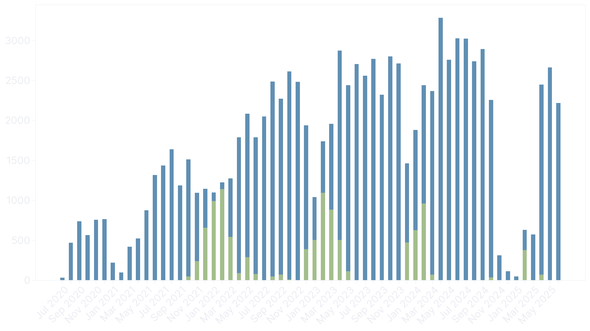
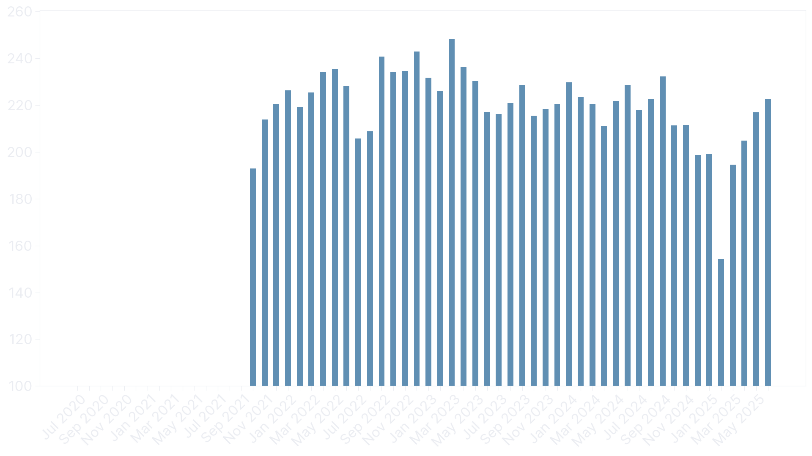
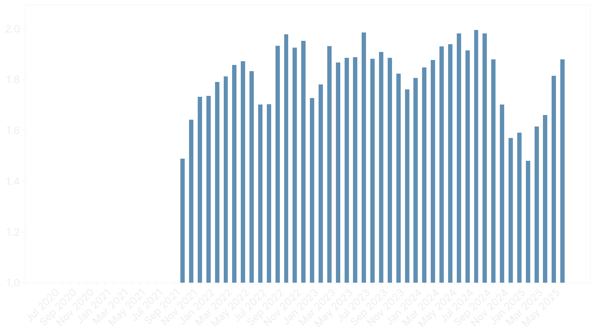
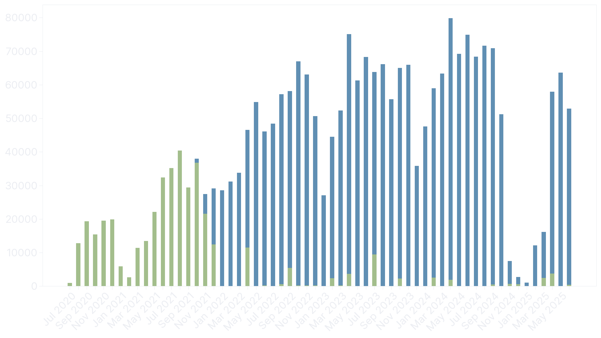

I started cycling back in mid-2020. It wasn't due to COVID-19, like for the many others. I finished my bachelor's degree in October the year before and got myself a job. I had the income of a junior software developer and the lifestyle of a student. For the first time in my life, I could afford nice things: a larger apartment closer to work and a shiny new bike worth riding.

Commuting turned into exercise and then, [as always](/about/), obsession. Recently, I crossed the 100,000 km mark --- 100,895 km to be precise. It took 1166 rides with an average distance of 87 km and 3156 hours to do so. An additional 400 hours were spent resting, in a café or socializing afterward. I've gathered more than enough data about myself to warrant a small review in this post.



The first figure shows the distance in kilometers. Outdoor rides are no fun during the cold winter months, so indoor rides on a trainer, shown in green, take their place. It's up to you to decide whether these count or not. Both mentally and physically, they are harder, but they also provide a nice opportunity to catch up on movies and TV shows released during the summer. Indoor rides accounted for 10,286 km and 320 hours, so around 10% of my total output.

The distance steadily increased year over year, almost hitting 30,000 km in 2024. Unfortunately, this got prevented by a six-month-long knee injury following a traffic accident. Something I might complain about in a future post --- got some interesting MRI images and wrong diagnoses to share.


After one year, I got myself a heart rate monitor and a power meter. The continuous decrease in heart rate is a good representation of both my fitness increase and unwillingness to go hard on every ride as volume rose. It averages 133 bpm, with a measured maximum of 190 bpm. The outlier in February 2025 coincides with the comeback from my knee injury, a vacation in Spain where I pushed quite hard despite being in an unfit/detrained state.



The more important metric, however, is power output. It averages 223 W and was a little higher during the early years, where I rode harder than necessary. With increased volume and knowledge in training theory came a more relaxed riding style focused on polarized training with high-quality sessions.


That can be observed using normalized power, which is supposed to be a [better representation of a ride's training stress](https://www.trainingpeaks.com/blog/what-is-normalized-power/) compared to average power. It averages 247 W and didn't change much over the years. Unfortunately, Strava doesn't provide normalized power and rather uses its own formula, seemingly based on [xPower](https://science4performance.com/tag/xpower/). So I had to [calculate](https://www.trainingpeaks.com/coach-blog/normalized-power-how-coaches-use/) it myself:

```python
def normalized_power(power_data):
    # Need at least 30 seconds
    if len(power_data) < 30:
        return None

    power_data = np.array(power_data, dtype=np.float64)
    # Create 30 second rolling average
    rolling_average = np.convolve(power_data, np.ones(30) / 30, mode="valid")
    # Raise to 4th power
    rolling_average_4th = rolling_average ** 4
    # Average
    mean_4th = np.mean(rolling_average_4th)
    # Take 4th root
    return mean_4th ** 0.25
```



If we divide normalized power by heart rate, we get the [efficiency factor](https://www.trainingpeaks.com/blog/efficiency-factor-and-decoupling/). It specifies the watts produced per heartbeat. While it might not make sense to compare it between days or weeks, it's a useful metric to track improvements in aerobic efficiency over time. Here we can see an upward trend, mostly driven by the decrease in heart rate.



<!-- Todo: mention how calories are calculated from power data -->

But the funniest metric to think about is the amount of calories burned. It's easy to calculate if power data is available `3.6 * average power * hours`. The formula is relatively simple because the joule to calorie conversion rate (1 J = ~0.24 cal) and the gross efficiency of a trained cyclist ([18--25%](https://chatgpt.com/s/dr_6853d8ed787c819181fc5aacf89283f5)) happen to cancel each other out.

2631 hours with power data burned 2,111,322 kcal. The remaining 530 hours, shown in green, have no power data available due to the power meter being either empty or nonexistent. If we assume an average output of 210 W for those rides, we can add another 400,743 kcal, which brings the total up to 2,512,065 kcal. That's equivalent to:

- 10,048 [hamburgers](https://www.mcdonalds.com/us/en-us/product/hamburger.html) (250 kcal each)
- 4331 [Big Macs](https://www.mcdonalds.com/us/en-us/product/big-mac.html) (580 kcal each)
- 7850 [medium fries](https://www.mcdonalds.com/us/en-us/product/medium-french-fries.html) (320 kcal each)
- 61,269 [chicken nuggets](https://www.mcdonalds.com/us/en-us/product/chicken-mcnuggets-10-piece.html) (41 kcal each)
- 5981 liters of [Coca Cola](https://www.coca-cola.com/de/de/brands/brand-coca-cola) (420 kcal/l)

A feast of epic proportions!

<!--
Rides: 1166
Distance: 100895.93479999989 km
Average distance: 86.53167650085753 km
Moving time: 3161.349999999998 h
Elapsed time: 3589.778055555553 h
Average speed: 31.91545852246665 km/h
Indoor distance: 10286.7182 km
Indoor time: 319.9330555555556 h
Outdoor distance: 90609.2166 km
Outdoor time: 2841.4169444444433 h
Average watts: 222.88831682248548 W
Average normalized watts: 247.41432661584227 W
Average heartrate: 133.49497275231712 bpm
No power distance: 15776.096600000006 km
No power time: 530.0833333333334 h
No power calories: 400743.0 kcal
Power distance: 85119.83819999987 km
Power time: 2631.2666666666673 h
Power calories: 2111322.9543999983 kcal
Calories: 2512065.9543999983 kcal
-->
