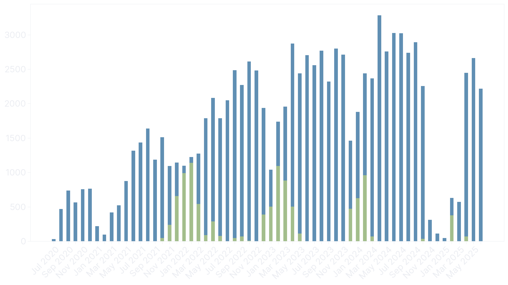
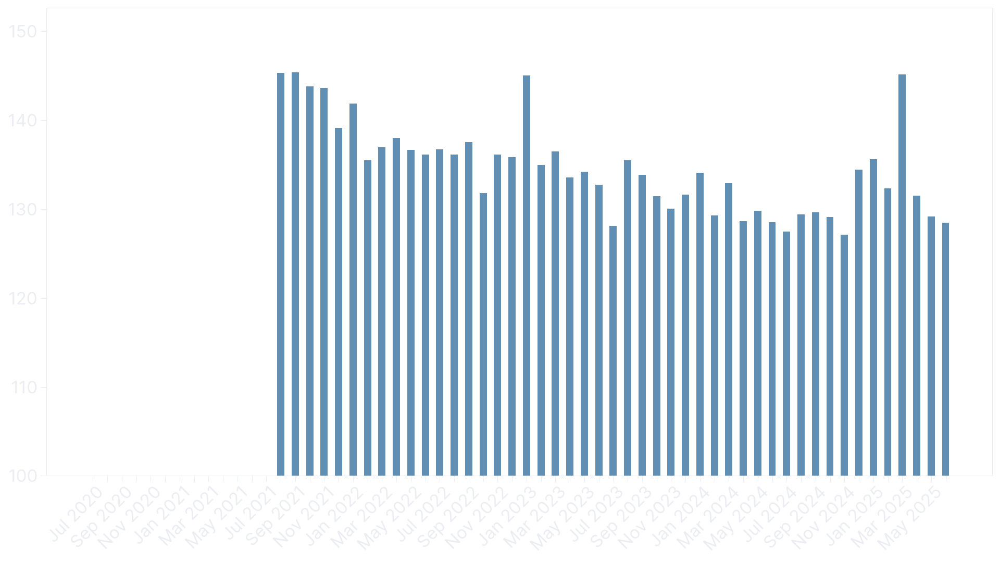
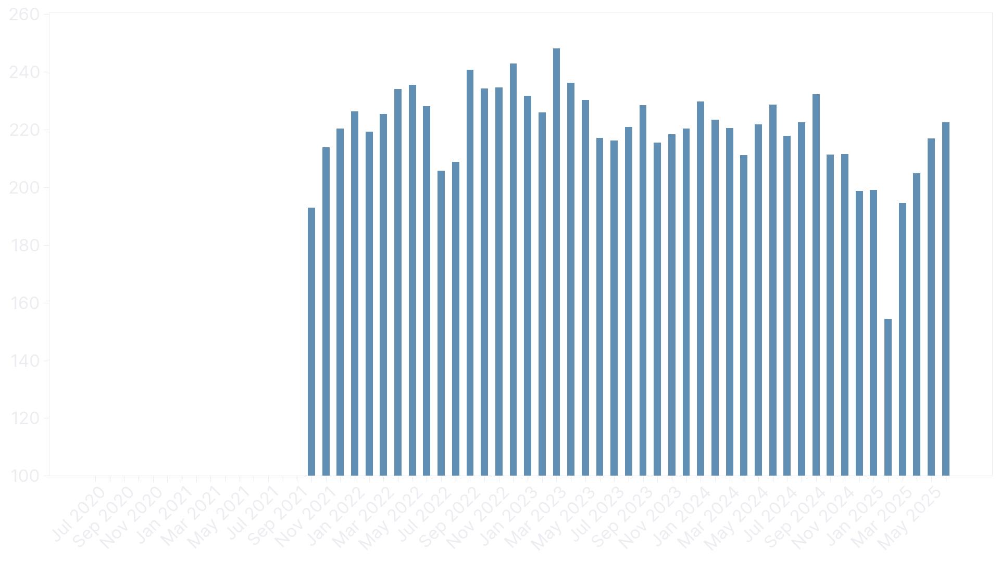
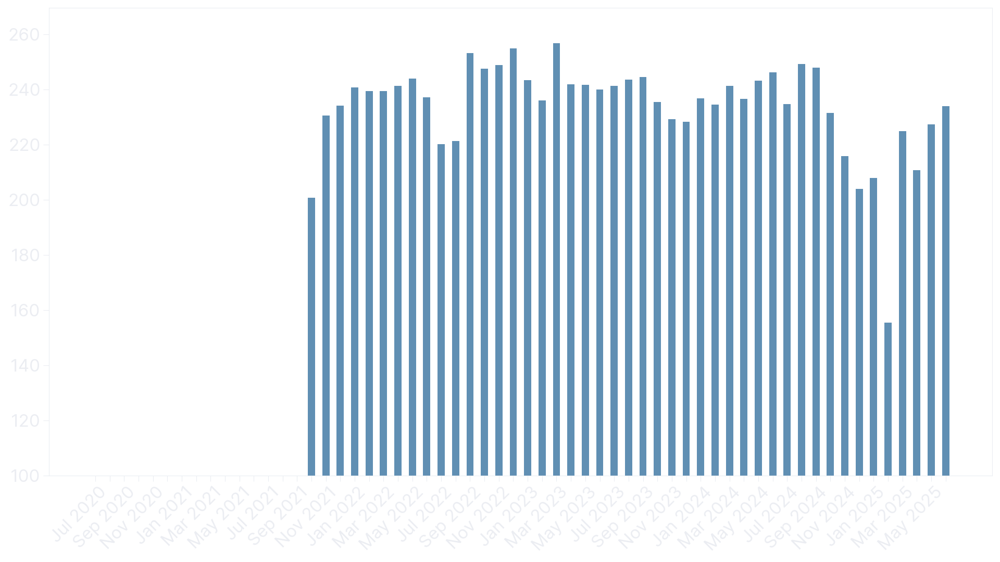
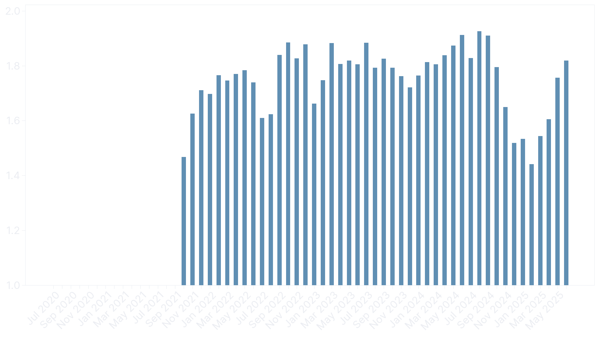

I started cycling back in mid-2020. It wasn't due to COVID. I finished my bachelor's degree in October the year before and got myself a job. I had the payroll of a junior software engineer and the lifestyle of a student. For the first time in my life, I could afford nice things: a larger apartment closer to work and a shiny new bike worth riding.

Commuting turned into exercise and then obsession. Recently, I crossed the 100,000 km mark --- 100,895 km to be precise. It took 1166 rides with an average distance of 87 km and 3156 hours to do so. An additional 400 hours were spent resting, in a café or socializing afterward. I've gathered more than enough data about myself to warrant a small analysis in this post.

The first figure shows the distance in kilometers. Outdoor rides are no fun during the cold winter months, so indoor trainer rides, shown in green, take their place. It's up to you to decide whether these count or not. They accounted for 10,286 km and 320 hours, so around 10% of my total output.

The distance steadily increased year over year, almost hitting 30,000 km in 2024. Unfortunately, this got prevented by a six-month-long knee injury following a traffic accident. Something I might complain about in a future post --- got some MRI images and wrong diagnoses to share.

After one year, I got myself a heart rate monitor and a power meter. The continuous decrease in heart rate is a good representation of my fitness increase. It averages to 133 bpm, with a measured maximum of 190 bpm. The peak in February 2025 coincides with my comeback from the knee injury, a vacation in Spain where I pushed myself quite hard.

The more important stat, however, is power output. It averages to 223 W and was a little higher during the early years, where, in retrospect, I pushed myself more than necessary. With increased volume and knowledge in training theory came a more relaxed riding style focused on polarized training with high quality sessions.

That can be observed using weighted power. Unfortunately, Strava doesn't provide normalized power, which is the industry standard, and rather uses their own formula, which seems to be based on [xPower](https://science4performance.com/tag/xpower/). It averages to 238 W and stayed even over the years.

If we divide weighted power by heart rate, we get the efficiency factor [^ef]. It specifies the watts produced per heartbeat. While it might not make sense to compare it between days or weeks, it's a useful tool to track fitness over long periods of time.

[^ef]: Normally, the efficiency factor is calculated using normalized power.

But the funniest stat to think about is the amount of calories burned. It's easy to calculate if power data is available. 2631 hours with power data burned 2,111,322 kcal. The remaining 530 hours without power data burned, assuming an output of 200 W, another 381,600 kcal, bringing the total up to 2,492,922 kcal. 2.492 gigacalories. That's an equivalent of:

- 9971 [hamburgers](https://www.mcdonalds.com/us/en-us/product/hamburger.html) (250 kcal)
- 4298 [Big Macs](https://www.mcdonalds.com/us/en-us/product/big-mac.html) (580 kcal)
- 7790 [medium fries](https://www.mcdonalds.com/us/en-us/product/medium-french-fries.html) (320 kcal)
- 60,802 [chicken nuggets](https://www.mcdonalds.com/us/en-us/product/chicken-mcnuggets-10-piece.html) (41 kcal)
- 5935 l [Coca Cola](https://www.coca-cola.com/de/de/brands/brand-coca-cola) (420 kcal)
- 528 kg sugar (4000 kcal)

<!--
Rides: 1166
Distance: 100895.93479999989 km
Average distance: 86.53167650085753 km
Moving time: 3161.349999999998 h
Elapsed time: 3589.778055555553 h
Average watts: 222.88831682248548 W
Weighted average watts: 237.95497299568416 W
Average heartrate: 133.49497275231712 bpm
Distance with power data: 85119.83819999987 km
Time with power data: 2631.2666666666673 h
Calories: 2111322.9543999983 kcal
Indoor distance: 10286.7182 km
Indoor time: 319.9330555555556 h
-->
