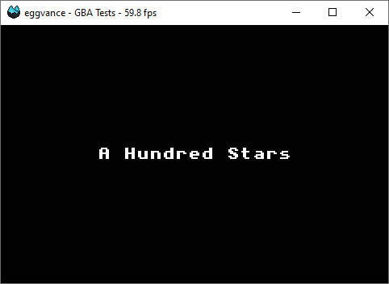

It may not sound like much, but one of my [GitHub repositories](https://github.com/jsmolka) recently passed the one hundred star mark. It's not the one I'm most proud of, but the one that seems to be the most useful to other developers: [GBA tests](https://github.com/jsmolka/gba-tests). I wrote it along with my Game Boy Advance emulator [eggvance](https://github.com/jsmolka/eggvance) to verify its CPU implementation. I tried to cover as many edge cases as possible to eliminate the chance of something misbehaving, because finding such a thing will drive you **crazy**. It was a much nicer experience to work on other parts of the system without the possibility of a CPU bug lingering in the back of my mind.

{.w-50}
