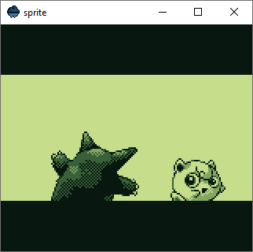
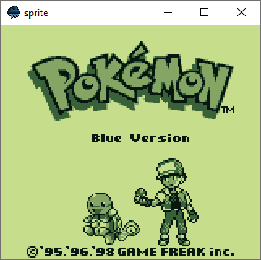

The [previous post]() was meant to mark the end of sprite and drizzle development. I achieved everything I ever wanted: a working programming language and a program large enough to prove its maturity to handle medium-scale problems. But some part of me just couldn't let it go. I love efficient programs, and the fact that sprite could not run games at native speed bothered me, so I decided to make one final push toward performance.

## Benchmark
I didn't want to change much of sprite's code. I think it turned out quite readable for a single file, 1586 lines emulator. But the one thing I knew I had to remove was the overarching `class`. Each use of `this` went through the hash maps of the instance and its class, which is **slow**. How slow? Let's define a simple benchmark.

- 
- 
{.fluent}

We run the Pokémon Blue intro sequence until we see the title screen. That's 1200 frames and requires around 20 seconds on hardware. The version of sprite with the class takes 46 seconds to complete, while the version with free functions and variables takes just 34 seconds. That's 12 seconds less and brings us closer to the magical 20-second mark.

## Cache Misses
drizzle underwent lots of small changes that accumulated over time, but I want to focus on the two most impactful ones. One of them concerns the call stack and how it's stored inside the virtual machine.

```cpp
class Vm {
  struct Frame {
    u8* pc;  // Program counter
    std::size_t sp;  // Stack pointer
    DzFunction* function;
  };
  sh::stack<Frame> frames;
};
```

The `Frame` object stores the called function, the stack pointer and the program counter, which points to the current position in the function's bytecode. Each opcode or argument read accesses the PC and increments it by a certain amount. Due to this nature, it's one of the most, if not the most accessed variable of the virtual machine. I used a stack to store call frames and accessed the current one with `frames.top()`.

```cpp
class Vm {
  Frame frame;
  sh::stack<Frame> frames;
};
```

That introduced an indirection and possible cache miss because the `frames` object allocates its items on the heap. Moving the frame into the virtual machine eliminated that possibility and lowered the benchmark time by five seconds.

## Specializing Adaptive Interpreter

At this point, I was down to 25 seconds and couldn't think of anything more to reduce it by yet another five seconds. I decided to go through Python's source code to find some motivation. I know Python isn't known as a fast programming language, but the devs made good progress on that front in the last releases. I saw lots of macros, computed gotos and the solution to my problem: [PEP 659](https://peps.python.org/pep-0659/), the specializing adaptive interpreter.
It assumes that opcodes at certain locations in the bytecode will be called with the same operand types and tries to optimize for them. It uses an inline cache and heuristics to achieve that. I implemented a much simpler version.

The first time an opcode is called, the VM tries to optimize it.

```cpp
void Vm::add() {
  auto [a, b] = peekBinary();
  if (checkTypes(a, b, DzValue::Type::Int)) {
    patch(Opcode::AddInt);
  } else {
    patch(Opcode::AddGeneric);
  }
}
```

Subsequent calls will use the optimized opcode if the operand types match the expected one.

```cpp
void Vm::addInt() {
  auto [a, b] = peekBinary();
  if (checkType(a, b, DzValue::Type::Int)) {
    a.i += b.i;
    stack.pop();
  } else {
    patch(Opcode::AddGeneric);
  }
}
```

If not, a generic one will be used in the future.

```cpp
void Vm::addGeneric() {
  binary("+", []<typename A, typename B>(const A& a, const B& b) -> DzValue {
    if constexpr (dz_int<A, B> || dz_float<A, B>) {
      return a + b;
    }
    throw NotSupportedException();
  });
}
```

The specializing adaptive interpreter worked wonders with sprite. Almost all opcodes use integers and can be optimized, which resulted in a ten-second performance boost in the benchmark. And just like that, sprite can now emulate games at their native frame rate!

| Build                                                                                        | Changes                           | sprite (class) | sprite (no class) |
| -------------------------------------------------------------------------------------------- | --------------------------------- | -------------- | ----------------- |
| [92522aa9](https://github.com/jsmolka/drizzle/tree/92522aa9d085394d8797f555e97b8db82ae65a59) | Baseline                          | 46570 ms       | 34441 ms          |
| [fcfa48be](https://github.com/jsmolka/drizzle/tree/fcfa48be160bf035442ba200991f01ee5f402b22) | Language cleanup                  | 44362 ms       | 32223 ms          |
| [56957c1c](https://github.com/jsmolka/drizzle/tree/56957c1c3ba308253dba8b15dc9f6e21d219b4a7) | Frame as a class member           | 38546 ms       | 27774 ms          |
| [35e5116e](https://github.com/jsmolka/drizzle/tree/35e5116e8743c23bdb70c7453cb41a3df7757e1b) | Optimized switch opcode           | 36798 ms       | 26105 ms          |
| [d2c1f656](https://github.com/jsmolka/drizzle/tree/d2c1f656718c407264a833260d140664c4385038) | Improved inlining and branching   | 36254 ms       | 25422 ms          |
| [f2aee4fe](https://github.com/jsmolka/drizzle/tree/f2aee4fe38a619252e19675d4b03a13eb26d6add) | Specializing adaptive interpreter | 26009 ms       | 15837 ms          |

## Final Words
That's it. I increased the performance of drizzle by about 200% and cleaned up the code in the meantime. Both projects are now well-written and can the shelved without worries. Next, I want to do a project in something other than C++. The cryptic error messages, steep learning curve and memory safety issues can be a pain in the ass. I think it's time to try out Rust.
