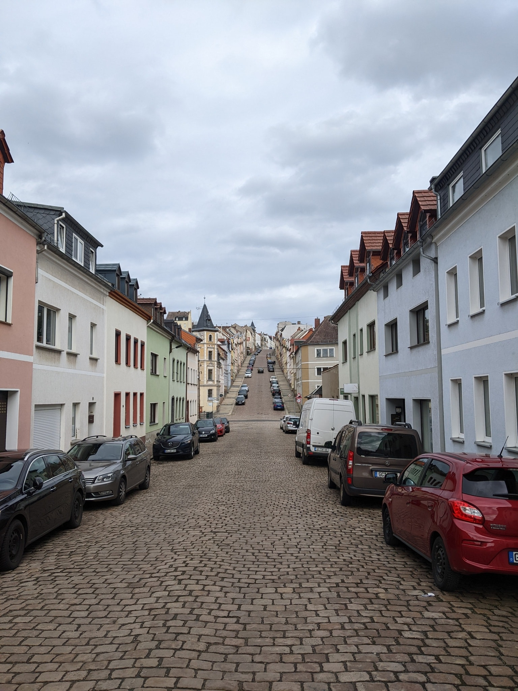
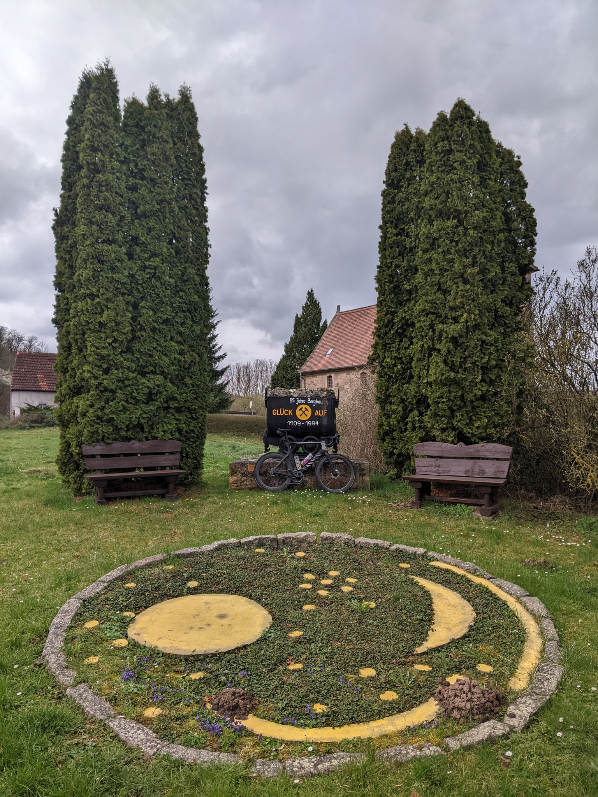

My mom loves to tell the story about picking me up from kindergarten. Its house and entrance were connected by a small stretch of pavement, and me walking it was an experience --- an endless loop of a child running, falling and standing back up. It seemed like I didn't know how to move slowly. I lost this magical urge to move over time and when I graduated from university, I was an unfit chubby mess of a human being [^1].

[^1]: A benefit of being almost two meters is that people don't realize that.

When I bought my first road bike for commuting, I didn't expect it to turn into the obsession it is today. Beginner gains kept me motivated to ride further and to ride faster. I quickly learned that muscle soreness isn't the thing to be afraid of in an endurance sport. It rarely happened to begin with, and today it isn't even a factor anymore. No, the thing that grinds you down is the systemic fatigue that comes from long consecutive days in the saddle.

- 
- 
{.fluent .escape}

Improving your body's ability to handle high-stress levels is a skill that develops gradually over time. I increased my average mileage throughout the years and decided to put my body to the test. I had a week of residual leave and kept delaying it, hoping for better weather, but the forecast was mixed at best. It turned out to be a cloudy and windy week with scattered showers, in which I rode 1094 km in 34:40, a milestone in my cycling career.
