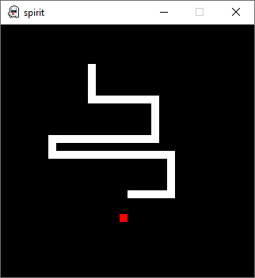

The transition time between two side projects is something I like a lot. There is no place for the mind to wander to during downtime, no sudden ideas in the bed that prevent you from sleeping and no frustration because something doesn't work even though it should --- I don't make mistakes. All of that sounds horrible for something you'd do in your free time, but the dopamine hits when you pass the first test, see the first pixel and get utterly blasted by the first audio sample, make more than up for it. Nostalgia, especially in emulation, is one hell of a drug.

## Into the Unknown
I wanted to try out Rust and needed something simple to ease into the language and its idioms. I've already emulated the [Game Boy](/tags/sprite/), so that thing was out of the picture. The next closest console in terms of difficulty was the NES [^1], which happens to be the first console I've ever owned!

[^1]: I didn't know it was called "NES" back then. Our village got flooded, and it was part of the donations we received. The most vivid memory I have of that thing is playing a tank game, which turned out to be [Battle City](https://en.wikipedia.org/wiki/Battle_City). I didn't know what I was playing on until I saw that game a few years ago.

So I went to work. I read through the [Rust book](https://doc.rust-lang.org/book/title-page.html), [Rustonomicon](https://doc.rust-lang.org/nomicon/intro.html) and other resources about the language. I thought about the high-level code structure of the emulator. [eggvance](/tags/eggvance/) used a global variable for each component of the system, which is bad. Rust favors a data-oriented approach, where the required components need to be passed as parameters. But I also don't want to add additional arguments to every function just because someone down the call stack needs it. I decided to have an overarching `NES` class and then pass a pointer to it to the components that require additional access.

```rust
struct Nes {
    mos: Mos,
}

impl Nes {
    pub fn new() -> Self {
        let mut this = Self {
            mos: Default::default(),
        };
        this.mos.nes = Pointer::new(&mut this);
        this
    }
}
```

I required something for `this.mos.nes` that is optional during initial construction and can contain mutable data. The thing that could work in safe Rust is `Option<RefCell<Box<Nes>>>`, which is quite a mouth full for the thing I need: a pointer. There won't be multithreading for Rust to protect me from, and I will never access a null pointer because it's set during construction. I created a simple struct to help with  dereferencing and safety assertions:

```rust
struct Pointer<T> {
    pointer: *mut T,
}

impl<T> Deref for Pointer<T> {
    type Target = T;

    fn deref(&self) -> &Self::Target {
        debug_assert!(!self.pointer.is_null());
        unsafe { &*self.pointer }
    }
}
```

## 6502
The console's heart is the MOS 6502. It's limited to one accumulator, two index and one status register but makes up for it with addressing modes. These allow instructions to operate in memory. Especially useful is the 256-byte zero page, which carries an overhead of one cycle over the accumulator and can be used for frequently accessed variables.

```rust
fn accumulator(&mut self) -> Option<u16> {
    None
}

fn zero_page(&mut self) -> Option<u16> {
    Some(self.read_byte_pc() as u16)
}

fn zero_page_x(&mut self) -> Option<u16> {
    Some((self.read_byte_pc() as u16 + self.x as u16) & 0xFF)
}
```

Each addressing mode returns an optional 16-bit address, which is used as an operand for the instructions. Two modes don't address memory: implied, which means that there is no operand and accumulator, which uses the accumulator as the operand. In the emulator, we use the `None` state of the supplied address to check for the latter.

```rust
fn get_operand(&self, addr: Option<u16>) -> u8 {
    if let Some(addr) = addr {
        self.read_byte(addr)
    } else {
        self.a
    }
}
```

The instructions themselves are quite easy.

```rust
fn logical_shift_right(&mut self, addr: Option<u16>) {
    let mut operand = self.get_operand(addr);
    self.p.c = operand & 0x01 != 0;
    operand >>= 1;
    self.p.set_zn(operand);
    self.set_operand(addr, operand);
}
```

## Snake
[Snake 6502](https://skilldrick.github.io/easy6502/#snake) is a snake implementation for the 6502 --- shocking. It has nothing to do with the NES and relies on custom memory mappings, which can be implemented rather easily. It's nice to see that the basics of the CPU are working before moving on to the PPU and proper hardware tests.

- 
- 
{.fluent}
