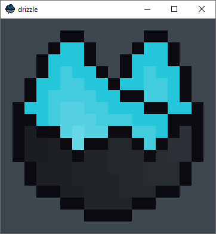

The latest version of drizzle adds the remaining language features required to implement a basic emulator. That includes a `switch` statement to run the typical main loop:

```drizzle
switch opcode:
  case 0x00:
    noop
  case 0x01:
    noop
  case 0x02:
    noop
  default:
    print("bad opcode")
```

Functions for file interaction:

```drizzle
var rom = read_bin("rom.gb")
if rom == null:
  noop  # Handle read error
if rom.size() < 0x8000:
  noop  # Handle size error
var gbc = rom[0x0143]
```

And a simple SDL2 interface:

```drizzle
var pixels = []  # Data
var window = sdl_window("drizzle", 18, 18, 20)

for pixel in pixels:
  var x = (pixel >> 28) & 0x0F
  var y = (pixel >> 24) & 0x0F
  window.set_pixel(x + 1, y + 1, 0xFF000000 | pixel)
window.render()

while sdl_events():
  if sdl_keystate(41):  # Escape
    window.dispose()
    break
```

Which renders the following scenes:

- 
- 
{.fluent}
