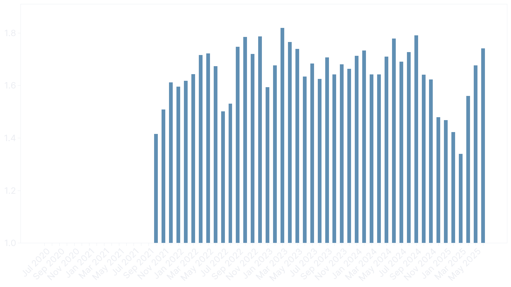

<!--
Distance: 100500.98419999989 km
Moving time: 3149.261388888887 h
Elapsed time: 3576.822777777775 h
Average watts: 222.9341304911075 W
Weighted average watts: 238.04626207479618 W
Average heartrate: 133.52871390741578 bpm
Distance with power data: 84724.88759999987 km
Time with power data: 2619.178055555556 h
Calories: 2102055.056699998 kcal
Indoor distance: 10286.7182 km
Indoor time: 319.9330555555556 h
-->
