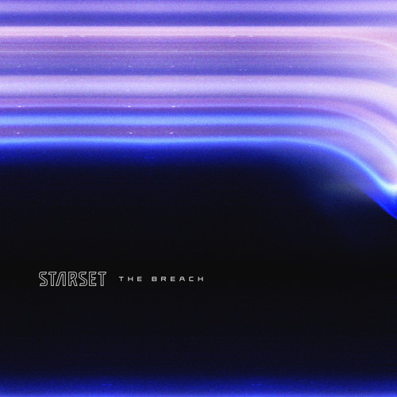
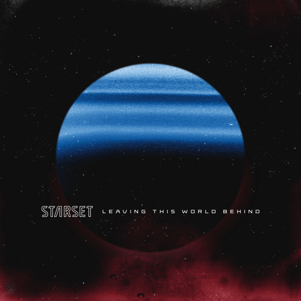
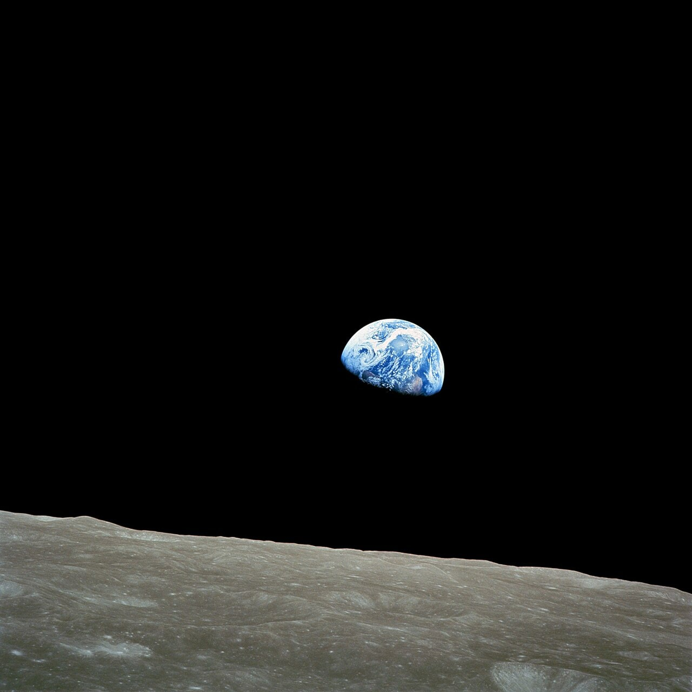

> In a restless search for new opportunities and new ways of living 
> The mystery and the promise of distant horizons 
> Always have called men forward 
>
> <cite>[Where The Skies End intro](https://www.youtube.com/watch?v=1DHY4cgQwE8) [^divisions], quote from [To New Horizons](https://www.youtube.com/watch?v=tAz4R6F0aaY&t=55s)</cite>

[^divisions]: This song isn't part of Horizons. My two favorites, [Where The Skies End](https://www.youtube.com/watch?v=1DHY4cgQwE8) and [Perfect Machine](https://www.youtube.com/watch?v=keMBtyjYUPQ), are part of its predecessor, the dark and dystopian Divisions. Both should be enjoyed with high quality headphones/boxes and the volume cranked up to barely comfortable levels.

Around eleven years ago, I watched a [gaming montage](https://www.youtube.com/watch?v=fli0N0RVmXw) featuring the song [My Demons](https://www.youtube.com/watch?v=nkll0StZJLA) by a newly formed band called Starset. I didn't know it back then, but they would one day become my favorite. Its frontman, Dustin Bates, a PhD in electrical engineering and former U.S. Air Force researcher, created the band to combine his interests in [science and music](https://x.com/starsetonline/status/346082788879003648).

Bates self-describes their music as cinematic rock, [blending symphonics with electronics with guitar hard rock](https://eu.goerie.com/story/entertainment/local/2015/09/10/cinematic-band-starset-opens-for/24940226007/). The symphonics appear in the form of through-composed outros with adventurous melodies. Unfortunately, they have become less frequent in newer releases. The lyrics cover everything from love and space to the dystopian use of technology in authoritarian civilizations. Their latest album, Horizons, was released on October 22, 2021 and is the thing I want to dissect in this post.

## Creative Direction
- https://www.instagram.com/brandonrike
- Tension Division, https://tensiondivision.com/project/starsethorizons

Discuss the used font
{.font-axion-rnd}

## Artwork
While artwork and creative direction might appear supplemental to the musical experience, they are of great importance to me. Good covers stand out and draw you in. If you find one that resonates with you, it is almost impossible to not listen to the album. That's the feeling I had, and still have, with the cover of Horizons. The LP sits proudly between my speakers as a decorative piece and catches the eye every so often.

It features the side profile of a female head. The back fades into the nothingness of space, while the front is enlightened by a mystery that unravels in front of her. The eyes look up towards the stars and the fading colors make it seems like she is connected to the universe itself. The three white dots near her temple most likely represent the brain machine interface, a part of the wider Starset lore, but something I am not really interested in.

<figure>
  

    

    

    

    

    

    

    

    

  

  <figcaption>Horizons cover color palette</figcaption>
</figure>

The colors perfectly capture space for me. The black and dark blue represent the nothingness, while the electric blue and pink and calming orange and red represent the immense forces acting throughout the universe. Similar colors are used in the singles preceding the album.

- 
- 
- 
{.fluent}

## Songs
I wrote this post primarily to talk about how the design and creative direction resonate with me, but I can't end it without talking about the songs themselves. When listening to music, I tend to not focus on the lyrics too much. That is due to my German ears not understanding some English words acoustically and me not placing much importance on the lyrics in the first place. I listen to music for the feeling I get. Melody, flow and a good chorus make or break a song for me. Of course, I am not ignorant to the lyrics, but they play a minor role.

1. **Unveiling the Architecture**: Instrumental introduction to the album. Same as in all their previous albums.
2. **The Breach**:
3. **Otherworldly**:
4. **Icarus**: This song begins with the outro of Otherworldly
    > And he told him 
    > "Beware, do not fly too close to the sun 
    > The blaze will surely melt those wings." 
    > But alas, he fell 
    > His cries, swallowed by the sea 
5. **Earthrise**:
    
6. **Leaving This World Behind**:
7. **Devolution**:
8. **Annihilated Love**:
9.  **Alchemy**:
10. **Disappear**: Only song with a composed outro, something that's been missing compared to older albums.
11. **This Endless Endeavor**:
12. **Symbiotic**:
13. **Dreamcatcher**:
14. **Tunnelvision**:
15. **Infected**:
16. **Something Wicked**:

> In a search that has continued for centuries 
> Some far distant view 
> With this promise of the unseen 
> And it's promise of the unknown 
> Has forever fathered the impulse 
> To seek for new things in new places 
> New horizons 
>
> <cite>[Where The Skies End outro](https://www.youtube.com/watch?v=1DHY4cgQwE8&t=277s), quote from [To New Horizons](https://www.youtube.com/watch?v=tAz4R6F0aaY&t=108s)</cite>

---

## Albums, Please
