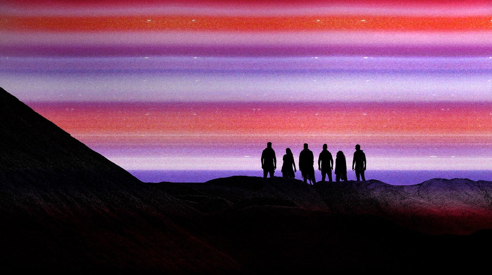
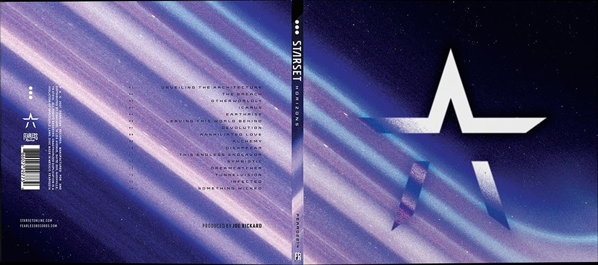

> In a restless search for new opportunities and new ways of living 
> The mystery and the promise of distant horizons 
> Always have called men forward 
>
> <cite>[Where The Skies End intro](https://www.youtube.com/watch?v=1DHY4cgQwE8) [^divisions], quote from [To New Horizons](https://www.youtube.com/watch?v=tAz4R6F0aaY&t=55s)</cite>

[^divisions]: This song isn't part of Horizons. My two favorites, [Where The Skies End](https://www.youtube.com/watch?v=1DHY4cgQwE8) and [Perfect Machine](https://www.youtube.com/watch?v=keMBtyjYUPQ), are part of its predecessor, the dark and dystopian Divisions. Both should be enjoyed with high quality headphones/boxes and the volume cranked up to barely comfortable levels.

---

Around eleven years ago, I watched a [gaming montage](https://www.youtube.com/watch?v=fli0N0RVmXw) featuring the song [My Demons](https://www.youtube.com/watch?v=nkll0StZJLA) by a newly formed band called Starset. I didn't know it back then, but they would one day become my favorite. Its frontman, Dustin Bates, a PhD in electrical engineering and former U.S. Air Force researcher, created the band to combine his interests in [science and music](https://x.com/starsetonline/status/346082788879003648).

Bates self-describes their music as cinematic rock, [blending symphonics with electronics with guitar hard rock](https://eu.goerie.com/story/entertainment/local/2015/09/10/cinematic-band-starset-opens-for/24940226007/). The symphonics appear in form of through-composed outros with [adventurous and space-travel-like melodies](https://youtu.be/W7qIlpV-uwo?t=229). Unfortunately, they have become less frequent in newer releases. The lyrics cover everything from love and space to the dystopian use of technology. Their latest album, Horizons, was released on October 22, 2021 and is the thing I want to dissect in this post.

## Creative Direction
Something Starset has nailed since its inception is the creative direction. They publish lots of supplemental material and Bates even authored two novels, [The PROX Transmissions](https://merch.starsetonline.com/products/the-prox-transmissions-novel) and [A Brief History of the Future](https://merch.starsetonline.com/products/a-brief-history-of-the-future-novel), fleshing out the Starset universe.  Music videos take place inside of it and fans often comment about wanting an entire movie. There exists a [Google Doc](https://docs.google.com/document/d/e/2PACX-1vQAtvJU4ghdGGvpDfss4ZTCz5_Ns3jaAyz9r-2eR_heL96kWWZ2i9mOrEqv6SWMyXEI9OC8bGeO12Fn/pub) summarizing all the lore, but to be honest, I don't really care about that kind of stuff. I'm here for the music.

Speaking of which, the first single of Horizons to be released was Infected. At that point, nobody knew there was a new album in the works. The cover artwork features a different visual style compared to the following singles. It has a scanned-paper-like appearance, doesn't use the outlined Starset wordmark, uses less kerning for the title and doesn't fit the color scheme in general.

- ")
- ")
{.fluent}

The album promotion began five months later with The Breach, continued with Leaving This World Behind and ended with Earthrise. The singles have a very coherent cover artwork style, despite being very visually distinct. For them and the whole album, Starset teamed up with [Brandon Rike](https://brandonrike.com/) of [Tension Division](https://tensiondivision.com/project/starsethorizons), who served as creative director and lead designer for popular bands like Twenty One Pilots, Korn and Weezer.

- ")
- ")
{.fluent}

## Font
The font used on covers and other media is called Axion RND. It features rounded and futuristic-looking characters with a small height difference between uppercase and lowercase ones. That probably influenced the decision to capitalize all text, something I'm usually opposed to. I dislike song titles screaming at me in filenames or apps, but they do look good on covers.
{.font-axion-rnd}

## Artwork
While cover artworks might appear supplemental to the musical experience, they are of great importance to me. Good covers stand out and draw you in. If you find one that resonates with you, it's almost impossible to not listen to the album. That's the feeling I had, and still have, with the cover of Horizons, which is one of my favorites, if not the favorite. Its vinyl version is used as a decorative piece between the speakers in my living room and catches the eye every so often.

")

It features the side profile of a female head. Its back fades into the nothingness of space, while the face is enlightened by the mystery that unravels in front of her. The eyes look up towards the sky, where the stars and wider universe reside. The fading colors make it seem like she is either consumed by or connecting with what's in front of her. The three white dots near her temple are almost perfectly centered and represent the [brain machine interface](https://www.youtube.com/watch?v=-u4AwQGLEsE), a part of dystopian Starset lore.

<figure>
  

    

    

    

    

    

    

    

    

  

  <figcaption>Horizons cover color palette</figcaption>
</figure>

The colors wonderfully capture space for me. Black and dark blue represent the emptiness, nothingness and mystery of space. Electric blue, pink and purple represent the immense energy of the forces acting throughout it. Orange and red add some sense of warmth, while the dark red adds an element of danger and the unknown. The grainy and noisy texture used in all Horizons media helps with the raw, powerful and imperfect aesthetic.

## Music
This post exists because of my admiration for the artwork surrounding the album. It's great in isolation, but the quality of music elevates it to another level. Horizons consists of 16 songs and is unusually long for a modern album, with a runtime of 71 minutes. I won't go over every song, because both my vocabulary and music theory knowledge aren't equipped to handle the task. But I will dissect some of my favorites:

- [Otherworldly](https://www.youtube.com/watch?v=l_MtK_kPtNU):
    The fist of many love songs.
    The song's outro leads into the next song Icarus.

    > And he told him 
    > "Beware, do not fly too close to the sun 
    > The blaze will surely melt those wings." 
    > But alas, he fell 
    > His cries, swallowed by the sea 

- **Icarus**:
    This song begins with the outro of Otherworldly

- [Earthrise](https://www.youtube.com/watch?v=ggCkN3Sve9w):
    The song is named after a famous picture taken by Willam Anders during the Apollo 8 space mission, the first crewed voyage to orbit the moon. Since the moon landing didn't happen until Apollo 11, it was taken from lunar orbit.

    ")

    Earthrise's chorus starts with probably one of the best line of the entire album.

    > I still fall for you like suns do for skies 
    > Cerulean pouring in from your eyes 
    > Just a hollow moon that you colorize 
    > So powerful, I feel so small but so alive 
    > Like watching the Earth rise 

- **Leaving This World Behind**:

- **Disappear**: Only song with a composed outro, something that's been missing compared to older albums.

- **This Endless Endeavor**:

- [Something Wicked](https://www.youtube.com/watch?v=CDq5TO05NcQ):
    The last song of the album is Something Wicked. Outros in previous albums tended to be on quieter side, and this one is no exception until its finale. The song's structure is unusual, as it doesn't follow the ABABCB format, and instead feels like a carefully crafted narrative.

    The lyrics are littered with biblical references (_pray_, _crucifix_, _god_, _serpent tongue_) and tell the story of a protagonist being consumed/overtaken by _Something Wicked_. The song starts calm with just a piano and then layers in strings and other instruments over the following verses. The build-up reaches its climax during the bridge, when it turns from calm to violent:

    > Out of myself, I can feel it crawling 
    > How can I tell if this is the ending? 
    > Out of myself, it began evolving 
    > I am not well, repent, I'm guilty 
    > How can I tell if the sky is falling? 
    > How can I fix what there is no mending? 
    > How can I tell if I am not well? 
    > I've lost myself, I have come undone 
    > And all of the horses 
    > And all of the men 
    > Won't put it back in place 
    > Or bury it where it had been 
    > When all of the forces 
    > Have been overrun 
    > You'll whisper, serpent tongue 
    > What you fear you have become 

    After that, the silence and piano return. The protagonist has lost the fight with his inner darkness. The album concludes with the whispered words:

    > Something wicked this way comes 
    > Something wicked this way comes 

    A theme has been referenced in newer releases like [Dystopia](https://www.youtube.com/watch?v=E2uwT_SctB0):

    > Lock your windows, close your doors and hide 
    > Something wicked has got inside 
    > Post-dramatic trauma addict high 
    > We're the victims of our device 
    > Lock your windows, close your doors and hide 
    > Something wicked has got inside 

    And [Dark Things](https://www.youtube.com/watch?v=2AB3_l0iqSk):

    > You came in on a whisper, drip by drip 
    > And leaked in 'til my heart was filled with this 
    > The middle of your ocean, here I sit 
    > In my emptiness, in my own wickedness 

## Symbolism
Ever since Divisions, Starset had a symbol for each song.

- 
- 
- 
- 
- 
- 
- 
- 
- 
- 
- 
- 
- 
- 
- 
- 
{.symbols}

---

> In a search that has continued for centuries 
> Some far distant view 
> With this promise of the unseen 
> And it's promise of the unknown 
> Has forever fathered the impulse 
> To seek for new things in new places 
> New horizons 
>
> <cite>[Where The Skies End outro](https://www.youtube.com/watch?v=1DHY4cgQwE8&t=277s), quote from [To New Horizons](https://www.youtube.com/watch?v=tAz4R6F0aaY&t=108s)</cite>
