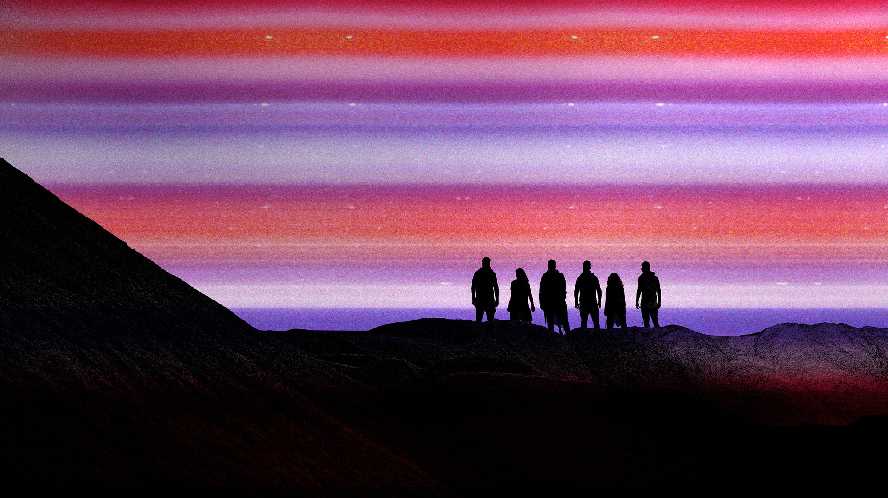

> In a restless search for new opportunities and new ways of living 
> The mystery and the promise of distant horizons 
> Always have called men forward 
>
> <cite>[Where The Skies End intro](https://www.youtube.com/watch?v=1DHY4cgQwE8) [^divisions], quote from [To New Horizons](https://www.youtube.com/watch?v=tAz4R6F0aaY&t=55s)</cite>

[^divisions]: This song isn't part of Horizons. My two favorites, [Where The Skies End](https://www.youtube.com/watch?v=1DHY4cgQwE8) and [Perfect Machine](https://www.youtube.com/watch?v=keMBtyjYUPQ), are part of its predecessor, the dark and dystopian Divisions. Both should be enjoyed with high quality headphones/boxes and the volume cranked up to barely comfortable levels.

---

Around eleven years ago, I watched a [gaming montage](https://www.youtube.com/watch?v=fli0N0RVmXw) featuring the song [My Demons](https://www.youtube.com/watch?v=nkll0StZJLA) by a newly formed band called Starset. I didn't know it back then, but they would one day become my favorite. Its frontman, Dustin Bates, a PhD in electrical engineering and former U.S. Air Force researcher, created the band to combine his interests in [science and music](https://x.com/starsetonline/status/346082788879003648).

Bates self-describes their music as cinematic rock, [blending symphonics with electronics with guitar hard rock](https://eu.goerie.com/story/entertainment/local/2015/09/10/cinematic-band-starset-opens-for/24940226007/). The symphonics appear in form of through-composed outros with [adventurous and space-travel-like melodies](https://youtu.be/W7qIlpV-uwo?t=229). Unfortunately, they have become less frequent in newer releases. The lyrics cover everything from love, space and science fiction to the dystopian use of technology in authoritarian societies.

Their latest album, Horizons, was released on October 22, 2021 and is the thing I want to dissect in this post.

## Creative Direction
Something Starset has nailed since its inception is the creative direction. They publish lots of supplemental material and Bates even authored two novels, [The PROX Transmissions](https://merch.starsetonline.com/products/the-prox-transmissions-novel) and [A Brief History of the Future](https://merch.starsetonline.com/products/a-brief-history-of-the-future-novel), fleshing out the Starset universe.  Music videos take place inside of it and fans often comment about wanting an entire movie. There exists a [Google Doc](https://docs.google.com/document/d/e/2PACX-1vQAtvJU4ghdGGvpDfss4ZTCz5_Ns3jaAyz9r-2eR_heL96kWWZ2i9mOrEqv6SWMyXEI9OC8bGeO12Fn/pub) summarizing all the lore, but to be honest, I don't really care about that kind of stuff. I'm here for the music.

Speaking of which, the first single of Horizons to be released was Infected. At that point, nobody knew there was a new album in the works. The cover artwork features a different visual style compared to the following singles. It has a scanned-paper-like appearance, doesn't use the outlined Starset wordmark, uses less kerning for the title and doesn't fit the color scheme in general.

- ")
- ")
{.fluent}

The album promotion began five months later with The Breach, continued with Leaving This World Behind and ended with Earthrise. The singles have a very coherent cover artwork style, despite being visually distinct. For them and the whole album, Starset teamed up with [Brandon Rike](https://brandonrike.com/), co-founder of [Tension Division](https://tensiondivision.com/project/starsethorizons), who served as creative director and lead designer for popular bands like Twenty One Pilots, Korn and Weezer.

- ")
- ")
{.fluent}

## Font
The font used on covers and other media is called Axion RND. It features rounded and futuristic-looking characters with a small height difference between uppercase and lowercase ones. That probably influenced the decision to capitalize all text, something I'm usually opposed to. I dislike song titles screaming at me in filenames or apps, but they do look good on covers.
{.font-axion-rnd}

## Artwork
While cover artworks might appear supplemental to the musical experience, they are of great importance to me. Good covers stand out and draw you in. If you find one that resonates with you, it's almost impossible to not listen to the album. That's the feeling I had, and still have, with the cover of Horizons, which is one of my favorites, if not the favorite. Its vinyl version is used as a decorative piece between the speakers in my living room and catches the eye every so often.

")

It features the side profile of a female head. Its back fades into the nothingness of space, while the face is enlightened by the mystery that unravels in front of her. The eyes look up towards the sky, where the stars and wider universe reside. The fading colors make it seem like she is either consumed by or connecting with what's in front of her. The three white dots near her temple are almost perfectly centered and represent the [brain machine interface](https://www.youtube.com/watch?v=-u4AwQGLEsE), a part of dystopian Starset lore.

<figure>
  

    

    

    

    

    

    

    

    

  

  <figcaption>Horizons cover color palette</figcaption>
</figure>

The colors wonderfully express the feeling of space for me. Black and dark blue represent the emptiness, nothingness and mystery of space. Electric blue, pink and purple represent the immense energy of the forces acting throughout it. Orange and red add some sense of warmth, while the dark red adds an element of danger and the unknown. The grainy and noisy texture used in all Horizons media helps with the raw, powerful and imperfect aesthetic.

## Music
I am writing this post because of my admiration for the creative direction. It's great in isolation, but the quality of music elevates it to another level and makes it much more memorable. Horizons is quite long for a modern album and consists of 16 songs, including one short instrumental intro. In it, Starset continue to experiment with their sound, something they have done ever since their debut album:

1. **Transmissions** established the classic Starset formula: cinematic rock with orchestral elements and sci-fi-inspired themes. Some of the through-composed and long-winded outros turn songs into experiences. Tracks like [My Demons](https://www.youtube.com/watch?v=nkll0StZJLA) and [It Has Begin](https://www.youtube.com/watch?v=XZp3Mtn-YsI) continue to be among their most well known work.
2. **Vessels** refines the sound of Transmissions. It improves everything great from its predecessor and smooths out some of the rough edges, especially in terms of production. They released a deluxe version a year later, which included some of the [best instrumental versions](https://www.youtube.com/watch?v=j7l7ekbR-9c) I've every heard.
3. **Divisions** deviates from the classic Starset formula by having a much more futuristic sound design with heavy industrial influences. The narrative takes a leap forward in terms of storytelling and discusses dystopian themes like surveillance, human-machine integration and oppressive systems.
4. **Horizons** on the other hand is much more introspective and emotionally driven. It's polished, melodic, calm and has a pop-style production, making it more accessible to newer audiences while still retaining the cinematic rock identity.

When listening to music, I tend to focus on the sound and the emotion it conveys. To me, a melodic, powerful chorus makes a good song. Lyrics tend to play a background role, which is shame, because I've seen comments comparing Starset's singer Dustin Bates to a human thesaurus. So I took this post as an opportunity to analyze some of my favorite songs. If you are not interested in that find of stuff, feel free to [skip this part](#symbolism).

### Otherworldly
<!--
[Intro]
Otherworld, otherworldly
Otherworld, otherworldly
Otherworld, otherworldly
Otherworld, otherworldly

[Verse 1]
You're like an angel's song
I'm on my knees, waiting for the sound
Stuck in a world gone wrong
So lift me up, I'll never let you down
Light like a brand new day
Surreal and astounding
The site of a mystery
But I'm here on the ground

[Pre-Chorus]
Bring me to the edge and let me stay
Pull me in, I'll never push away
Searching for the words that I can say
How it feels when you're with me

[Chorus]
Otherworld, otherworldly
Sеnd a light then, I'll be waiting
Otherworld, othеrworldly
I come alive when you are with me
Otherworld, otherworldly
Far away from all the mayhem
Otherworld, otherworldly
At the speed of light and beauty

[Verse 2]
Supernatural
Like an oracle
When darkness starts to call
You'll find me after all
A face that could emanate
A stare like a spotlight
If you guide me into your space
I'll be there at the first light

[Chorus]
Otherworld, otherworldly
Send a light then, I'll be waiting
Otherworld, otherworldly
I come alive when you are with me
Otherworld, otherworldly
Far away from all the mayhem
Otherworld, otherworldly
At the speed of light and beauty

[Bridge]
I wanna become lucid
Clear, just like a window
I tried so hard to open up
And show you what's behind it
But you didn't need to hear me
'Cause you were supraliminal
Knew me without an uttered word
You always seemed to know me
An ethereal feeling
That I cannot describe
The way that I feel you
Something that I cannot hide
How you illuminate
In a profound way, I feel your space
I can't explain this place you're taking me
[Chorus]
Otherworld, otherworldly
Send a light then, I'll be waiting
Otherworld, otherworldly
I come alive when you are with me
Otherworld, otherworldly
Far away from all the mayhem
Otherworld, otherworldly
At the speed of light and beauty

[Spoken Outro]
And he told him
"Beware, do not fly too close to the sun
The blaze will surely melt those wings."
But alas, he fell
His cries, swallowed by the sea
-->
[Otherworldly](https://www.youtube.com/watch?v=l_MtK_kPtNU) is a prime example for the emotional lyrics and pop-style production of Horizons. Like most songs of the album, it follows the classic ABABCB structure (verse, chorus, verse, chorus, bridge, chorus). It's a love song in which the narrator describes his feelings. The song culminates in probably the best bridge of the album:

> I wanna become lucid 
> Clear, just like a window 
> I tried so hard to open up 
> And show you what's behind it 
> But you didn't need to hear me 
> 'Cause you were supraliminal 
> Knew me without an uttered word 
> You always seemed to know me 
> An ethereal feeling 
> That I cannot describe 
> The way that I feel you 
> Something that I cannot hide 
> How you illuminate 
> In a profound way, I feel your space 
> I can't explain this place you're taking me 

Its spoken outro foreshadows the next song:

> And he told him 
> "Beware, do not fly too close to the sun 
> The blaze will surely melt those wings." 
> But alas, he fell 
> His cries, swallowed by the sea 

### Icarus <!-- https://www.youtube.com/watch?v=ZfiSaBxGB9E -->
<!--
[Verse 1]
Fell out of the air and you broke your wings
Like you're doing every other time
Made a new pair out of broken things
To give it all another try
And you climb right up to the highest peaks
And reach out to the edge of the world you seek
Afraid of heights so you don't believe
You could ever be good enough

[Chorus]
Go on then, Icarus, take your turn
You always fly right up until it burns
Your wings you never could change
Always the victim, into the flames again
Go on then, Icarus, take your turn
You'll never go through thеm

[Verse 2]
Head in the clouds
Buried your feet in thе ground
Telling yourself it's the world that holds you down
But you've got your chin held high
And your chest pumped up
The replica of a runner-up
You were made for skies but you called your bluff
Now you'll never be good enough

[Chorus]
Go on then, Icarus, take your turn
You always fly right up until it burns
Your wings you never could change
Always the victim, into the flames again
Go on then, Icarus, take your turn
You'll never go through them
You'll never go through them
You'll never go through them

[Bridge]
Fall back down, back down again
You've got your head in the clouds, on the ground again
Oh, looking for a scapegoat to hold your feet
Pounding on your chest so you don't feel weak
You fall back down, back down again

[Chorus]
Go on then, Icarus, take your turn
You always fly right up until it burns
Your wings you never could change
Always the victim, into the flames again
Go on then, Icarus, take your turn
You'll never go through them
-->
An energetic song about a figure in Greek mythology. Icarus and his father Daedalus were imprisoned by king Minos and constructed wings from beeswax and bird feathers to escape. Daedalus warned his son to _not fly too close to the sun_, but he fell from the sky, plunged into the sea, and drowned. The lyrics explore the character flaws of Icarus, which led to his eventual downfall --- pun intended.

> Fell out of the air and you broke your wings 
> Like you're doing every other time 
> Made a new pair out of broken things 
> To give it all another try 

The song starts with Icarus falling from the sky yet again, but he is determined to give it another try. He reconstructs the wings from broken things, which might be a hint that he'll never achieve the thing he is striving for without a solid foundation. It might even be a hint that he himself is broken.

> And you climb right up to the highest peaks 
> And reach out to the edge of the world you seek 
> Afraid of heights so you don't believe 
> You could ever be good enough 

But despite his recent failure he willing to try again.

> And you climb right up to the highest peaks 
> And reach out to the edge of the world you seek 
> Afraid of heights so you don't believe 
> You could ever be good enough 

He is compelled to seek greatness but is simultaneously afraid of it, feeling inherently unworthy.

> Go on then, Icarus, take your turn 
> You always fly right up until it burns 
> Your wings you never could change 
> Always the victim, into the flames again 
> Go on then, Icarus, take your turn 
> You'll never go through thеm 

He is described a person refusing to change. He repeats the same mistakes over and over again, but blames the world around him for his failure, seeing himself as the victim.

> But you've got your chin held high 
> And your chest pumped up 
> The replica of a runner-up 
> You were made for skies but you called your bluff 
> Now you'll never be good enough 

He acts tough and confident, but doesn't even believe it himself. He will always be the _replica of a runner-up_, destined to be second, _never be good enough_.

### Earthrise
<!--
[Verse 1]
I push my feet to the edge
I look and I face my world
This lonely scene, I take it in
It's hard to say where all of it begins and I end
And I waited for the sky to change but, oh, it never did
And I almost dropped my head and lost my faith
Then I saw you from a distance, you were worlds away
Oh, but you had me from the vision, I never looked away again

[Chorus]
I still fall for you like suns do for skies
Cerulean pouring in from your eyes
Just a hollow moon that you colorize
So powerful, I feel so small but so alive
Like watching the Earth rise

[Verse 2]
I walk these streets of loneliness
A tranquil sea on all horizons
This empty scene of might-have-beens
I stare at starless skies that call to me and I still wish
(I still wish, I still wish, I still wish)

[Chorus]
I still fall for you like suns do for skies
Cerulean pouring in from your eyes
Just a hollow moon that you colorize
So powerful, I feel so small but so alive
Like watching the Earth rise

[Bridge]
They said that we both were too different
That all of the shine would fade away
But I wish that I never listened
'Cause you pulled me through the grey

[Chorus]
I still fall for you like suns do for skies
Cerulean pouring in from your eyes
Just a hollow moon that you colorize
So powerful, I feel so small but so alive
Like watching the Earth rise
-->
[Earthrise](https://www.youtube.com/watch?v=ggCkN3Sve9w) is named after a famous picture taken by Willam Anders during the Apollo 8 space mission, the first crewed voyage to orbit the moon. The original image was rotated by 95 degrees clockwise to better convey the sense of the Earth rising over the moonscape.

")

> And I waited for the sky to change but, oh, it never did 
> And I almost dropped my head and lost my faith 
> Then I saw you from a distance, you were worlds away 
> Oh, but you had me from the vision, I never looked away again 

The lyrics describe the narrator almost giving up on finding a partner, but falling in love right before that.

> I still fall for you like suns do for skies 
> Cerulean pouring in from your eyes 
> Just a hollow moon that you colorize 
> So powerful, I feel so small but so alive 
> Like watching the Earth rise 

The chorus starts with a beautiful wordplay on falling in love and sunsets. The following lines mention the [hollow moon](https://en.wikipedia.org/wiki/Hollow_Moon), a pseudoscientific hypotheses by science fiction writer H. G. Wells about the moon's interior being inhabited by aliens. It might be a metaphor for the narrator feeling hollow himself. The void is then filled by [cerulean](https://en.wikipedia.org/wiki/Cerulean), a sky blue color, which might the blue eyes of the other person.

### Leaving This World Behind <!-- https://www.youtube.com/watch?v=6Od_dO3ENJo -->
<!--
[Verse 1]
Beautiful, new frontier
High above the rain in the atmosphere
What wonders I have discovered
My soul is everclear
Never felt the way I do with you here
I hope there's never another

[Chorus]
So sing tonight, we're everbright
Burning through space, I see your face
I could beat kryptonite
We're so alive, forever high
Hold on, my dear, there'll be no fear
Leaving this world behind (This world behind)

[Verse 2]
Far away, above the earth
We'll soar through the curvature
Away from all our dark matters
And escape the barriers
That we’ve manufactured
Going into the hereafter
And I'll wait if you take forever long
I'll listen for your song

[Chorus]
So sing tonight, we're everbright
Burning through space, I see your face
I could beat kryptonite
We're so alive, forever high
Hold on, my dear, there'll be no fear
Leaving this world behind

[Chorus]
So sing tonight, we're everbright
Burning through space, I see your face
I could beat kryptonite
We're so alive, forever high
Hold on, my dear, there'll be no fear
Leaving this world behind (This world behind)
Leaving this world behind
(Leaving this world behind)

[Spoken Outro]
All good things
Must come to pass
Now is your time
-->
The arc continues. The narrator and other person are now in a relationship. The lyrics explore their feelings.

> Beautiful, new frontier 
> High above the rain in the atmosphere 
> What wonders I have discovered 
> My soul is everclear 
> Never felt the way I do with you here 
> I hope there's never another     

### Disappear <!-- https://www.youtube.com/watch?v=m-8n9YyfBB8 -->
<!--
[Verse 1]
So how long were you numb?
'Cause it was cold as ice
And I keep saying that I'm okay with it
But that's another lie
The truth is I've been dying slowly
But no, not you, you just
Turned to drift into the night
A parting scene of apathy
In an instant shift to a
Stone heart, paired with empty eyes
That stared right through mine

[Chorus]
I did the math but it just don't add up
There's a whole world that used to be us
Now there's an echo calling me
Just a shred of memory
Emptiness but there's still a shadow
I catch a glimpse of someone I should know
Hard to tell if you were ever here
I disappear, disappear
I disappear, disappear

[Verse 2]
All is lost, slipped away
Gone without a trace
I sometimes wonder if it was real because
All that's left seems fake
Like I'm trapped within a wrong dimension
I tried so hard just to
Make you feel my pain
If you had empathy, you'd see I'd changed
But like a ghost in your presence, I dissipate
I tried it all, it's all in vain

[Chorus]
I did the math but it just don't add up
There's a whole world that used to be us
Now there's an echo calling me
Just a shred of memory
Emptiness but there's still a shadow
I catch a glimpse of someone I should know
Hard to tell if you were ever here
I disappear, disappear
I disappear, disappear

[Bridge]
Sometimes, I still slip
And start to question if
It was only in my mind
It's hard to come to grips
That you still exist
When it feels just like you died
So come one and all
Step right up and I'll
Perform a trick before your eyes
I'll evaporate
Gone without a trace
Off the radar, out of sight

[Chorus]
I did the math but it just don't add up
There's a whole world that used to be us
Now there's an echo calling me
Just a shred of memory
Emptiness but there's still a shadow
I catch a glimpse of someone I should know
Hard to tell if you were ever here
I disappear, disappear
I disappear, disappear
-->
The relationship formed in previous songs came to an end. The narrator struggles to move on and mourns a person that's still alive.

> There's a whole world that used to be us 
> Now there's an echo calling me 
> Just a shred of memory 

> It's hard to come to grips 
> That you still exist 
> When it feels just like you died 

He thinks about disappearing, as in isolating himself, or, given the context of a song not discussed here, taking his life.

> I'll evaporate 
> Gone without a trace 
> Off the radar, out of sight 

The song ends with the only through-composed outro of the album and leads seamlessly into the next one.

### This Endless Endeavor
<!--
[Verse 1]
I separate
Into the arms of the broken
Accept this fate
Exposed to the world in the open
To drift from all I know

[Pre-Chorus]
I get lost in the world sometimes
Star-crossed, looking out for a light but it won't shine
So, North Star, come and guide me to you
In the wake of my own confines
I will wait for the day you call through the skylines
And I'll be waiting, I'll be waiting

[Chorus]
(Oh-Woah, Oh-Woah) I'm gone without you
(Oh-Woah, Oh-Woah) Could it be forever?
(Oh-Woah, Oh-Woah) Go on without you
(Oh-Woah, Oh-Woah) This endless endeavor
This endless endeavor

[Verse 2]
Lonely wade
Out to the depths of an ocean
A castaway
I suffer the death of emotion
Between the waves of woe

[Chorus]
(Oh-Woah, Oh-Woah) I'm gone without you
(Oh-Woah, Oh-Woah) Could it be forever?
(Oh-Woah, Oh-Woah) Go on without you
(Oh-Woah, Oh-Woah) This endless endeavor
This endless endeavor
This endless endeavor
This endless endeavor

[Pre-Chorus]
I get lost in the world sometimes
Star-crossed, looking out for a light but it won't shine
So, North Star come, North Star come
In the wake of my own confines
I will wait for the day you call through the skylines
And I'll be waiting, I'll be waiting

[Chorus]
(Oh-Woah, Oh-Woah) I'm gone without you
(Oh-Woah, Oh-Woah) Could it be forever?
(Oh-Woah, Oh-Woah) Go on without you
(Oh-Woah, Oh-Woah) This endless endeavor
This endless endeavor
-->
[This Endless Endeavor](https://www.youtube.com/watch?v=mcL8i_895QI) starts out strong with a memorable guitar riff and heavy drums. The energy quickly subsides and the song continues to alternate between calm, saddening verses and a haunting chorus. The lyrics explore the loss, death or otherwise, of an important individual.

> I separate 
> Into the arms of the broken 
> Accept this fate 
> Exposed to the world in the open 
> To drift from all I know 

The first verse describes the moments following a tragic event. The narrator is emotionally torn apart, separated, by what happened and resigns to the pain by falling into the arms of the broken. He accepts his fate, but feels vulnerable because he is exposed to the whole world, out in the open for everyone to see. This causes him to drift away from friends and family, reinforcing the feeling of loss, disconnection and isolation.

> Lonely wade 
> Out to the depths of an ocean 
> A castaway 
> I suffer the death of emotion 
> Between the waves of woe 

The isolation overwhelms the narrator. It causes him to break. Go shipwreck over the endless depths of an ocean. Go emotionally numb with only the waves of woe crashing against the broken remains of a ship that he used to call himself.

> I get lost in the world sometimes 
> Star-crossed, looking out for a light but it won't shine 
> So, North Star come, North Star come 
> In the wake of my own confines 
> I will wait for the day you call through the skylines 
> And I'll be waiting, I'll be waiting 

He is lost in the world, star-crossed --- destined to fail --- looking out for a North Star to guide him through the rest of his life. He is filled with hope to one day connect with his significant again.

> (Oh-Woah, Oh-Woah) I'm gone without you 
> (Oh-Woah, Oh-Woah) Could it be forever? 
> (Oh-Woah, Oh-Woah) Go on without you 
> (Oh-Woah, Oh-Woah) This endless endeavor 

The narrator doesn't feel like himself without his significant other. He fears that he has to go on forever like this.

### Something Wicked
<!--
[Intro]
Loving
Hating
Hoping
Faking

[Verse]
I've been digging through the dirt that was left behind
I've been dredging through the mud for it
There's nothing that's alive or dead inside
In you or in this
The crucifix in my hand's a lie
'Cause nothing ever kills you
I've watered down the pain 'til the well went dry
So pray for rain

[Pre-Chorus]
And it gnawed
Rose to the top again
Back like a long-lost friend
A wretch that I can't defend
Oh my god
Is this where the dreamer ends?
Dark where the light had been
Lost at the war within

[Chorus]
And it clawеd
Back in the world again
Here for a nеw revenge
An enemy I can't condemn
Oh my god
Is this where the liar ends?
Dark where the light had been
Lost at the war within

[Bridge]
Out of myself, I can feel it crawling
How can I tell if this is the ending?
Out of myself, it began evolving
I am not well, repent, I'm guilty
How can I tell if the sky is falling?
How can I fix what there is no mending?
How can I tell if I am not well?
I've lost myself, I have come undone
And all of the horses
And all of the men
Won't put it back in place
Or bury it where it had been
When all of the forces
Have been overrun
You'll whisper, serpent tongue
What you fear you have become

[Outro]
Something wicked this way comes
Something wicked this way comes
-->
The album ends with [Something Wicked](https://www.youtube.com/watch?v=CDq5TO05NcQ). Outro songs in previous albums tended to be on the quieter side and this one is no exception until its finale. It begins calm with just a piano and then layers in strings and other instruments over the following verses. It doesn't adhere to the ABABCB structure and instead feels like a carefully crafted narrative of a person slowly being consumed/overtaken by _Something Wicked_.

> The crucifix in my hand's a lie 
> 'Cause nothing ever kills you 
> I've watered down the pain 'til the well went dry 
> So pray for rain 

The lyrics are littered with biblical references. The narrator describes the thing inside of him as powerful enough that even a crucifix can't kill it, hinting at its profoundly evil nature. He tried everything in his power to stop it, but had to resign in the end. Praying for rain feels more like a warning than a request. The narrator seems to have lost control and only a godly intervention can prevent the events lying.

> And it clawеd 
> Back in the world again 
> Here for a nеw revenge 
> An enemy I can't condemn 

It seems like it isn't the first time that the narrator had to confront the thing. It's crawling back into his world, looking for revenge. He's is describing it as an enemy, which he can't condemn. Maybe he think's that the feeling is justified.

As we enter the bridge, the song turns from calm to violent:

> Out of myself, I can feel it crawling 
> How can I tell if this is the ending? 
> Out of myself, it began evolving 
> I am not well, repent, I'm guilty 
> How can I tell if the sky is falling? 
> How can I fix what there is no mending? 
> How can I tell if I am not well? 
> I've lost myself, I have come undone 
> And all of the horses 
> And all of the men 
> Won't put it back in place 
> Or bury it where it had been 
> When all of the forces 
> Have been overrun 
> You'll whisper, serpent tongue 
> What you fear you have become 

After that, the silence and piano return. The narrator has lost the fight with his inner darkness. The album concludes with the whispered words:

> Something wicked this way comes 
> Something wicked this way comes 

The ending has been referenced in one of their [newer singles](https://www.youtube.com/watch?v=E2uwT_SctB0):

> Lock your windows, close your doors and hide 
> Something wicked has got inside 
> Post-dramatic trauma addict high 
> We're the victims of our device 
> Lock your windows, close your doors and hide 
> Something wicked has got inside 

## Symbolism
With knowledge about some songs I want to end this post by talking about the symbols, which were created for every Starset song since Divisions.

- 
- 
- 
- 
- 
- 
- 
- 
- 
- 
- 
- 
- 
- 
- 
- 
{.symbols}

The lyrics and symbol of a song go hand in hand. Some of them are obvious, while other leave some room for interpretation. Here are some of my thoughts and ideas:

- **The Breach** is a planet surrounded by shields, about to the breached
- **Otherworldly** is a planet surrounded by three Saturn-like rings
- **Icarus** is a person with wings
- **Earthrise** is the earth rising on the moon's horizon. It looks like the sun rising over the sea and reflecting on the waves.
- **Annihilated Love** is a broken heart
- **Alchemy** is an homage to [alchemical symbols](https://en.wikipedia.org/wiki/Alchemical_symbol). It's composed of circle and an inwardly rounded triangle. Both of them don't correlate to anything in our world.
- **This Endless Endeavor** is an endless corridor
- **Symbiotic** is a flower made of leaves
- **Dreamcatcher** is a [dreamcatcher](https://en.wikipedia.org/wiki/Dreamcatcher)
- **Tunnelvision** is a tunnel
- **Infected** is the top of three Starset symbols arranged like a biohazard warning sign.
- **Something Wicked** is an upside down Starset logo

## Fin
Puh, finally it's out of my system. This was a really hard post for me to write, especially considering my lacking vocabulary and knowledge in music theory and lyrical analysis. It wasn't a strength back in school and still isn't to this day. At least there isn't a teacher to tell me how my opinion is wrong. But writing it gave me a whole new appreciation for the lyrics and their deeper meaning, something I'm grateful for.

---

> In a search that has continued for centuries 
> Some far distant view 
> With this promise of the unseen 
> And it's promise of the unknown 
> Has forever fathered the impulse 
> To seek for new things in new places 
> New horizons 
>
> <cite>[Where The Skies End outro](https://www.youtube.com/watch?v=1DHY4cgQwE8&t=277s), quote from [To New Horizons](https://www.youtube.com/watch?v=tAz4R6F0aaY&t=108s)</cite>
