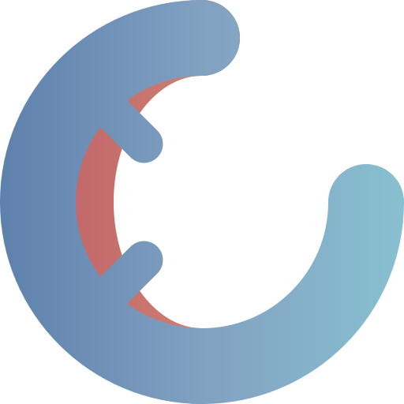

During the process of designing a new logo, I also stumbled across the idea of creating one featuring my favorite animal: the alpine newt [^favorite]. I used to hunt these majestic creatures in a small pond at the edge of my hometown. I went there for frogs, which was hard enough, but every once in a while, I had a small blue and orange jackpot in the landing net.

[^favorite]: I think nobody knows this fact about me.

- ")
{.escape}

The logo didn't turn out to be the winner, but it would be a waste of creativity to not even mention it. I sketched some initial drafts with pen and paper like a true artist. They all depict a newt curled up into a ball, with the tail fin almost touching its head. The design was inspired by the Firefox logo, but I lacked the artistic skill to combine the two concepts and express them on paper.

- 
- 
{.fluent}

- 
- 
{.fluent}

Turning these rough sketches into something usable was even more difficult. My Inkscape skills are limited to say the least, but learning is an ever present part of life, and the harder something is to learn, the better it is for your brain. I also thought about commissioning an artist, but not making the logo myself kind of defeated the purpose. It just wouldn't feel right.

- 
- 
- ")
{.fluent}

I ended up with two geometric and one golden-ratio-based drawing and ordered them from least to most favorite [^ratio]. They might make great mascots, but when I changed this blog's logo to one of them, I realized that they just didn't fit in. They are bright, colorful and way too attention-seeking. They disrupt the elegant design I am going for. So, in the end, I didn't use them. Nothing changed. Nothing new(t).

[^ratio]: I just love the look of animals drawn using golden ratios.
