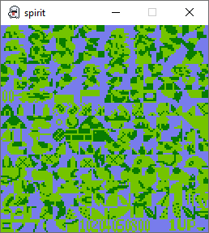
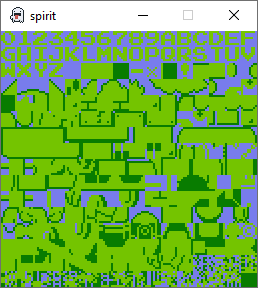
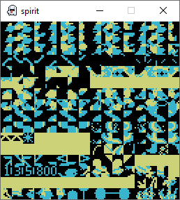
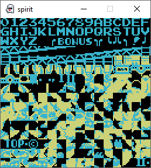

I published the last [post](/posts/christmas-spirit/) about my NES emulator spirit in December 2022. After that, work continued, the progress became visible, and I created the draft of this post a few months later. Now, over a year has passed and nothing has changed. I can't remember why I stopped, but I hate unfinished projects. It shouldn't take too long to finish, considering my previous work. Let's see if I can find the time and motivation to continue.

- 
- 
{.fluent}

- 
- 
{.fluent}
