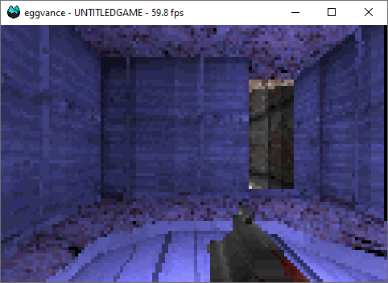
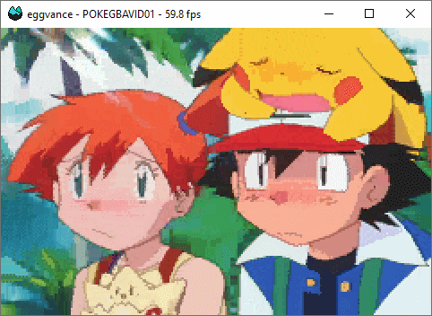
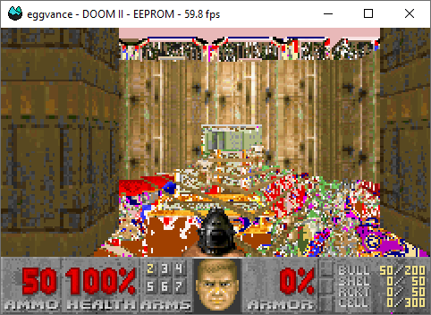
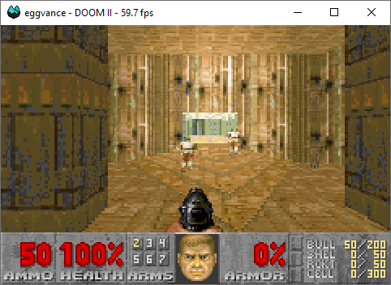

Hello there! It has been quite a while since the last progress report, two months to be exact. Development of the emulator has slowed down a little during that time because I started working full-time. Apart from cleaning up the codebase, I also fixed and implemented some things that might be of interest to some people.

## Bitmap Modes
The GBA has six different background modes that are evenly split into three tile-based and three bitmap modes. One would assume that games utilize bitmaps as much as tiles, but that's not the case in reality. Tiles tend to be faster and easier to understand and are therefore used in most games. One rare example of a game using bitmap modes is DOOM II, which uses them to display the scene created by its internal software renderer. Due to this kind of game being so rare, I didn't notice bugs in the bitmap implementation until very recently, when I was going through some of the demos on [gbadev.org](https://www.gbadev.org/).

- 
- 
{.fluent}

The images above show the technically impressive [Yeti demo](https://www.gbadev.org/demos.php?showinfo=568). It's a first-person shooter with a custom 3D engine and uses background mode 5 to display the scene. The resolution of the bitmap in this mode is 160x128 pixels. The left image shows an old version of the emulator, which directly copied the bitmap to the 240x160 pixel screen without further processing. That was incorrect because bitmaps can make use of the rotation/scaling matrix.

```cpp
void PPU::renderBgMode5(int bg) {
  // Maximum dimensions of this bitmap
  static constexpr Dimensions dims(160, 128);
  // Iterate over horizontal screen pixels
  for (int x = 0; x < SCREEN_W; ++x) {
    // Map current pixel to bitmap coordiantes
    // Remove fractional portion with shift
    const auto texture = transform(x, bg) >> 8;
    // Invalid coordinates are transparent
    if (!dims.contains(texture)) {
      backgrounds[bg][x] = TRANSPARENT;
      continue;
    }
    // Bitmap offset = 16-bit color * (160 * texture.y + texture.x)
    int offset = sizeof(u16) * texture.offset(dims.w);
    // Read and mask (explained in next section) color
    backgrounds[bg][x] = mmu.vram.readHalfFast(
      io.dispcnt.base_frame + offset) & 0x7FFF;
  }
}
```

The fixed version of the renderer applies the `transform` function to the current pixel, which returns the coordinates inside the bitmap. Those are then used to determine the pixel's color. The matrix used in the Yeti demo scales the bitmap by two and thus fills the entire screen. The black pixels on the right are part of the game and not by the emulator.

## Color Masking
The Game Boy Advance encodes colors in the BGR555 format and stores them in 16-bit halfwords. They are stored in a dedicated area in memory called palette RAM (PRAM). It consists of two 512-byte blocks for background and sprite colors. The first color of each block can be used to draw transparent pixels. An obvious use case for this is sprites, which aren't always perfect squares. If a pixel has been marked as transparent, the next pixel in the drawing order will be displayed.

- 
- 
{.fluent}

Since the drawing process is separated from merging backgrounds and sprites into the final scene, transparent pixels must be marked as such. Luckily the most significant bit in each color doesn't carry information and can be (mis)used for this purpose. This means that transparent pixels are represented by the color `0x8000`. The approach worked well until I booted the game Mother 3. Its intro screen uses `0x8000` to display white and messed up my whole system.

```cpp
u16 Palette::colorBGOpaque(int index, int bank) {
  return readHalfFast(0x20 * bank + 2 * index) & 0x7FFF;
}

u16 Palette::colorBG(int index, int bank) {
  return index == 0
    ? TRANSPARENT
    : colorBGOpaque(index, bank);
}
```

The problem can be fixed with a quite simple solution. Every color read from the palette needs to be masked with `0x7FFF` to clear the most significant bit. That prevents confusing transparent pixels with malformed white pixels.

## Sprite Tile Restrictions
This issue is another prime example of the "most games don't use bitmaps, therefore I can't test them" category. If you compare both images down below, you will notice some strange, colorful pixels in the top left corner of the first one. Those are uninitialized sprites that were wrongfully rendered by the emulator.

- 
- 
{.fluent}

The cause of this problem is best described in Martin Korths [GBATEK](https://problemkaputt.de/gbatek.htm), which is the most comprehensive and complete reference document for the GBA. That even holds up when compared to Nintendo's official programming manual.

> OBJs are always combined of one or more 8x8 pixel Tiles (much like BG Tiles in BG Modes 0-2). However, OBJ Tiles are stored in a separate area in VRAM: 06010000-06017FFF (32 KBytes) in BG Mode 0-2, or 06014000-06017FFF (16 KBytes) in BG Mode 3-5. Depending on the size of the above area (16K or 32K) and on the OBJ color depth (4bit or 8bit), 256-1024 8x8 dots OBJ Tiles can be defined.
>
> <cite>Martin Korth, [GBATEK](https://problemkaputt.de/gbatek.htm#lcdobjoverview)</cite>

The important part here is the one talking about tile address restrictions for different background modes. Bitmap modes (background modes 3 to 5) can't use as many sprite tiles as tiled backgrounds. That is because some bitmap modes use multiple frames that occupy the first `0x4000` bytes of sprite tile memory. The code below shows the calculation of a tile address followed by the necessary check.

```cpp
u32 addr = mmu.vram.mirror(entry.base_tile + size * tile.offset(tiles));
if (addr < 0x1'4000 && io.dispcnt.isBitmap())
    continue;
```

## Final Words
That's it with the changes worth writing about, and even those were pretty meh. Most of the things I did during the last months were minor accuracy improvements and cleanups in the codebase. Even the DOOM II color problems have been fixed with a rather simple [commit](https://github.com/jsmolka/eggvance/commit/36e2cdd38e795d09a39594353e256b5b83fe9c47). Another important thing is the addition of Linux and macOS support. Removing Windows-dependent code and writing a simple CMake file took more time than I'd like to admit.

- 
- 
{.fluent}
