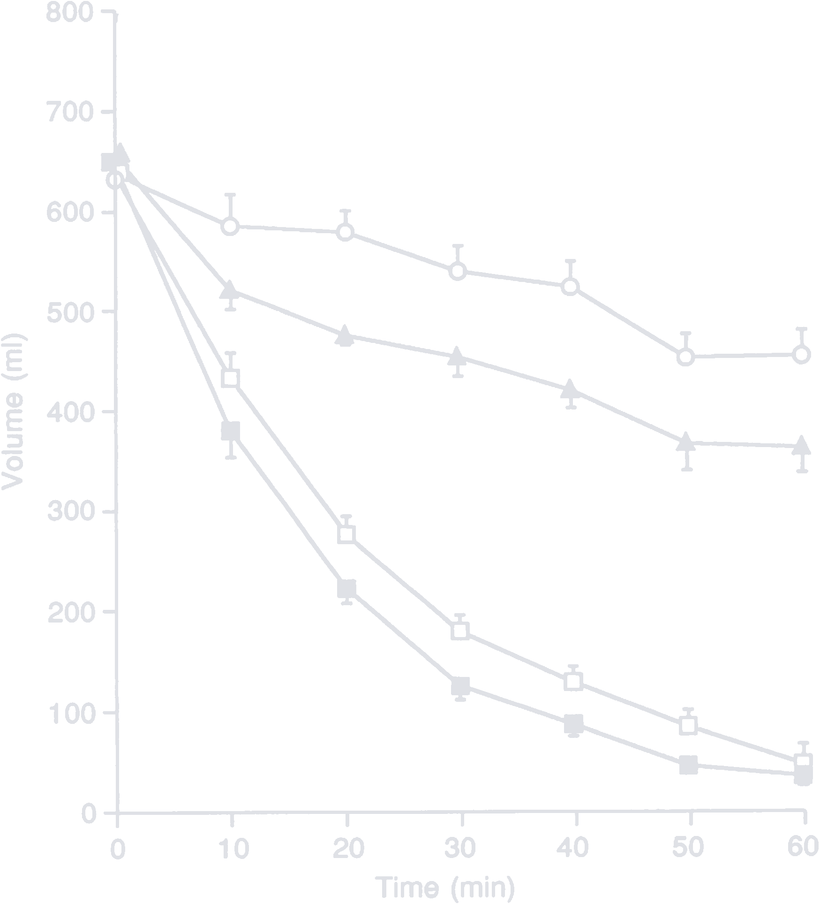
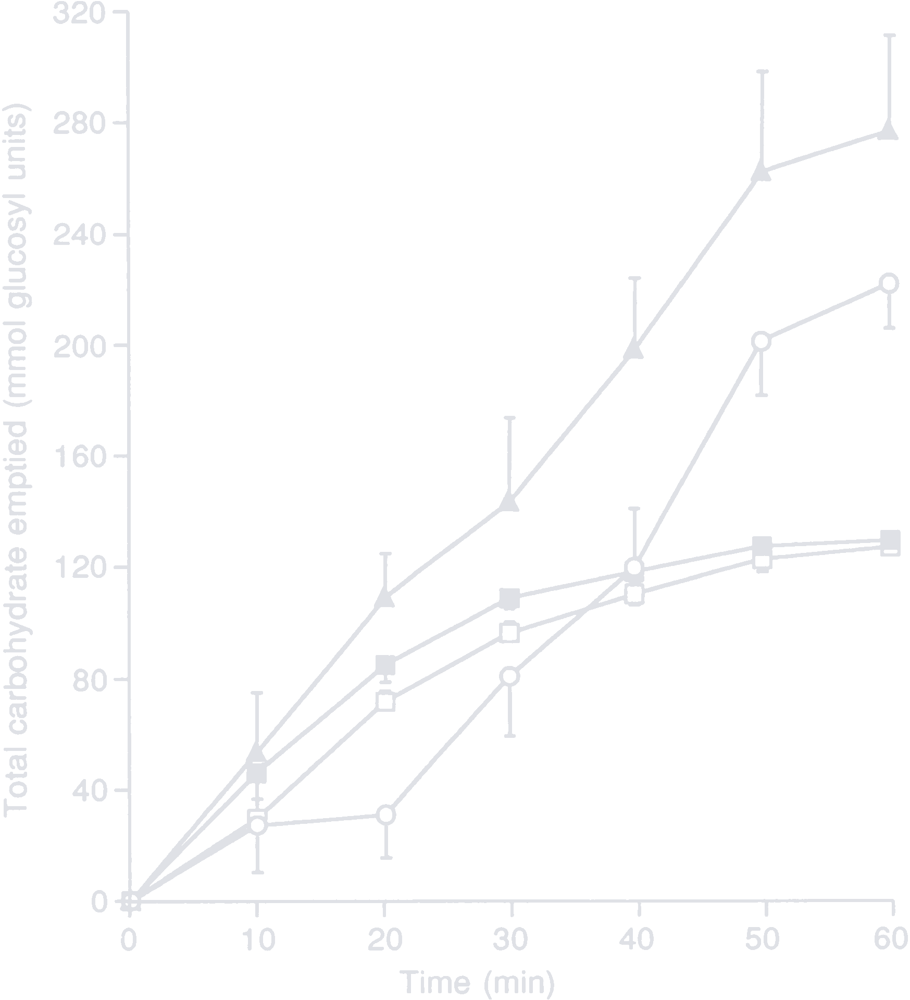

The water bottle is an essential cycling accessory. It comes in a more or less standardized shape and can hold anything from 500 to 1000 ml of liquid, usually a mixture of water, carbohydrates, electrolytes and flavorings. Athletes new to the sport might disregard the importance of the latter ones and go for a ride with just plain water. If they are unlucky, they will [hit the wall](https://en.wikipedia.org/wiki/Hitting_the_wall) a few hours in --- the so called **bonk** --- and crawl to the next cafe, supermarket or gas station to consume sweet sustenance.

Professional teams, on the other hand, have this more or less figured out. The EF pro cycling team churns through [34,000 bottles annually](https://efprocycling.com/culture/no-more-plastic-bottles/) and estimates the whole professional peloton be somewhere around 630,000 bottles. Numbers like that are caused by the way bottles are used during one-day and stage races. On hot days, bottles with cold water are handed out to the riders, which then pour them over their heads to reduce their body's core temperature and thus allow for better performance on the bike. Emptied bottles, with or without carbohydrates, are then cast to the side of the road or handed out to spectators as souvenirs [^littering].

[^littering]:
    In 2021, the UCI cracked down on littering:

    > Riders may not jettison food, bonk-bags, feeding bottles, clothes, etc. outside of the litter zones provided by the organiser. The rider must safely and exclusively deposit their waste on the sides of the road in the litter zones provided by the organiser.
    >
    > <cite>UCI regulation 2.2.025</cite>

    The rule prohibited riders from handing out bottles to spectators. After a few fines and outrage from the public, the UCI added a special provision:

    > Riders are only permitted to give their water bottles to spectators on climbs in the last 50 kilometres of the event or stages. Riders must ensure that the throwing of their water bottles to the public does not present any danger [...].
    >
    > <cite>UCI special provision for littering no. 2</cite>

")

Most professional teams have a nutrition sponsor that provides bars, gels and drink mixes for bottles. This article will be a breakdown of what and how much should go into a bottle. At the end, I will suggest a cheaper alternative to the, in my opinion overpriced, popular nutrition brands and compare the cost over the course of a year.

## Carbohydrates
Gone are the days of training with just water. Today's professional athletes push the limit of their gut as much as the limit of their legs. Absorption rates of [150 grams per hour](https://www.trainerroad.com/blog/how-to-use-carbs-for-maximum-performance/) are not uncommon and require nutritional training. Gradually increasing carbohydrate intake between training sessions accustoms the gut to a more intense fueling strategy. Experimenting with a higher than usual intake on race day might end it prematurely on the toilet instead of the finish line.

The recommended carbohydrate intake varies based on exercise duration and intensity:

<figure>

| Workout duration | Minimum [g/h] | Recommended [g/h] | Maximum [g/h] |
| ---------------- | ------------- | ----------------- | ------------- |
| <0.5 h           | 0             | 10                | 30            |
| 0.5-1 h          | 0             | 20                | 50            |
| 1-1.5 h          | 20            | 30                | 70            |
| 1.5-2 h          | 40            | 60                | 90            |
| 2-2.5 h          | 50            | 80                | 120           |
| 2.5-3 h          | 60            | 90                | 120-150       |
| 3-6 h            | 75            | 100               | 120-150       |
| >6 h             | 75            | 90                | 90            |
  <figcaption>

  Recommended carbohydrate intake by [Dr. Alex Harrison](https://www.trainerroad.com/forum/t/140g-carbs-per-hour/51650/19)
  </figcaption>
</figure>

High absorption rates are achieved by mixing glucose and fructose, which are metabolized by different pathways in the body and can thus be stacked on top of each other. In 2013, a [study by O'Brien et al.](pdf/glucose-fructose-ratio.pdf) investigated the optimal glucose/fructose ratio and arrived at the following conclusion:

> Modeling suggested fructose–maltodextrin–glucose ratios of between 0.8 to unity are oxidized with highest efficiency relative to the ingestion rate. The CHO metabolic responses were associated with a very likely moderate enhancement of mean sprint power with total- and endogenous-CHO oxidation rate, abdominal cramps, and drink sweetness presenting as candidate explanatory mechanisms. Therefore, oral CHO-hydration formulations containing fructose–maltodextrin–glucose at a ratio of around 0.8–1.0 may provide the most practical benefit for endurance athletes.
>
> <cite>O'Brien et al.</cite>

The popular nutrition brand Science in Sport launched its Beta Fuel drink mix in 2018 with a 2:1 glucose/fructose ratio and reformulated in 2021 to a 1:0.8 ratio, [citing](https://www.scienceinsport.com/sports-nutrition/the-science-behind-beta-fuel/) the, at this point eight year old, O'Brien et al. study. Other known brands like [Maurten](https://www.maurten.com/de/products/drink-mix-320) and [MNSTRY](https://mnstry.com/en/products/power-carb-heat-1-0-8) offer their own formulations based on a 1:0.8 ratio. It appears to be the magic number everybody is aiming for, even though figure 4 in the study seems to max out absorption around the 0.9-0.95 mark.

 total exogenous CHO ingested in the three experimental ratio drinks during endurance exercise")

This led me and others like [Jesse Coyle](https://www.youtube.com/watch?v=vT-PBsSLX3U) and [Dr. Alex Harrison](https://forum.slowtwitch.com/t/help-me-calculate-an-at-home-maurten-drink-im-bad-at-math/801656/10) to believe that sucrose, also known as table sugar, might be the best option in terms of scientific literature and cost. With an even ratio of glucose to fructose, it is on the other end of the recommended spectrum, but closer to the apparent maximum of 0.95.

I doubt one option is better than the other at this point. Get the one that works for you, but make sure it is in the 2:1/1:0.8 range.

<!-- But the reduction in cost certainly justifies its usage -->

## Electrolytes
The other integral part of a bottle is electrolytes. Athletes sweat around [0.5-2 liters](pdf/sweat-rate.pdf) per hour. If you have ever mismanaged your electrolyte balance on a hot day, you never want to do it again. Drinking just water and not replenishing electrolytes will end in cramps and misery.

The [composition of sweat](pdf/sweat-composition.pdf) looks like this:

| Element   | Concentration [mmol/l] | Atomic mass [u] | Concentration [mg/l] |
| --------- | ---------------------- | --------------- | -------------------- |
| Sodium    | 10-90                  | 22.99           | 230-2070             |
| Chlorine  | 10-90                  | 35.45           | 355-3191             |
| Potassium | 2-8                    | 39.1            | 78-313               |
| Calcium   | 0.2-2                  | 40.08           | 8-80                 |
| Magnesium | 0.02-0.4               | 24.31           | 1-10                 |

The most important mineral to replenish is sodium. This can be done with salt, which is around 39% sodium, or more exotic options like trisodium citrate, which is around 27% sodium. The reason why one should be preferred other the other will be explained in the [osmolarity chapter](#osmolalityosmolarity).

Sweat rate and sweat sodium concentration vary from person to person. Unless you get them measured there is no way to know for sure. You can ask yourself the following questions to estimate your liquid and sodium requirement:

1. **Am I a heavy sweater?** Heavy sweaters need to drink more.
2. **Am I a salty sweater?** Salty sweaters need to consume more sodium.

I am a heavy, salty sweater and aim for around 1500 mg/l of sodium.

### LMNT
But sweat contains more than just sodium. It also consists of other minerals like potassium and magnesium. If you are a podcast listener, you have probably heard of LMNT, the science-based electrolyte drink mix. Each pack contains 1000 mg sodium, 200 mg potassium and 60 mg magnesium [^lmnt].

[^lmnt]: The unflavored version of LMNT costs €1.5 per 3.5 g pack (€429/kg). My version, which uses the same components in the same ratio, comes in at around €8/kg. The price some people are willing to pay for this stuff is insane.

You can make your own LMNT at home:

- 1000 g sodium chloride (393 g sodium, 39.3%) <!-- €2/kg -->
- 150 g potassium chloride (79 g potassium, 52.4%) <!-- €10/kg -->
- 150 g magnesium malate (23 g magnesium, 15.5%) <!-- €45/kg -->

One gram contains:

- 303 mg sodium
- 61 mg potassium
- 18 mg magnesium

I have been using this as the basis for my electrolytes during the last year. It worked great. Retrospectively I could reduce the amount of magnesium, because it seems to be a little too much.

## Flavorings
Flavorings are personal. I prefer sour over sweet. The acidity provided by the flavorings and the saltiness provided by the electrolytes balance the sweet sucrose solution. I found dehydrated fruit powders to work the best. I used [lime powder](https://www.mexhaus.de/getraenke/spirituosen/reines-limettenpulver-aus-michoacan-apatzin-1-kg) for a long time and love the taste.  Unfortunately it is quite pricey, so I did some research and came up with a [replacement](https://www.corpserevived.com/post/maximizing-citrus-part-2-artificial-juice):

- 8 parts citric acid <!-- €3/kg -->
- 4 parts malic acid <!-- €18/kg -->
- 1 part tartaric acid <!-- €15/kg -->

It tastes good and provides the much needed acidity. That way I can use the lime powder throughout the day where taste matters so much more.

## Osmolality/Osmolarity
> Osmolality and osmolarity are measures that are technically different, but functionally the same for normal use. Whereas osmolality (with an "l") is defined as the number of osmoles (Osm) of solute per kilogram of solvent (osmol/kg or Osm/kg), osmolarity (with an "r") is defined as the number of osmoles of solute per liter (L) of solution (osmol/L or Osm/L). As such, larger numbers indicate a greater concentration of solutes [...].
>
> <cite>[Wikipedia](https://en.wikipedia.org/wiki/Plasma_osmolality)</cite>

Osmolality and osmolarity are calculated using `O = c / M * n` [^n], where:

[^n]: The complete formula also takes the [osmotic coefficient](https://en.wikipedia.org/wiki/Osmotic_coefficient) into consideration, which characterises the deviation of a solvent from ideal behavior. But that is taking it too far for this post.

- `c` is the solutes [mass fraction](https://en.wikipedia.org/wiki/Mass_fraction_(chemistry)) in g/kg (osmolality) or [mass concentration](https://en.wikipedia.org/wiki/Mass_concentration_(chemistry)) in g/l (osmolarity). Higher concentrations result in higher osmolalities and osmolarities.
- `M` is the solutes [molar mass](https://en.wikipedia.org/wiki/Molar_mass) in g/mol. Molecules with fewer and/or lighter atoms result in higher osmolalities and osmolarities.
- `n` is the solutes number of particles in solution. Ionic compounds, such as salts, can dissociate into their ions in solution and therefore contribute multiple particles per molecule. More particles result in higher osmolalities and osmolarities.

| Name            | Chemical formula                                      | Molar mass [g/mol] | Particles                                                                   |
| --------------- | ----------------------------------------------------- | ------------------ | --------------------------------------------------------------------------- |
| Glucose         | C6H12O6              | 180.16             | 1                                                                           |
| Sucrose         | C12H22O11            | 342.3              | 1                                                                           |
| Sodium chloride | NaCl                                                  | 58.44              | 2 (Na+ + Cl-)                                         |
| Sodium citrate  | Na3C6H5O7 | 258.07             | 4 (3 Na+ + C6H5O73-) |

It is possible to convert between osmolality and osmolarity using `R = L * D`, where:

- `R` is the osmola**R**ity in Osm/l.
- `L` is the osmola**L**ity in Osm/kg.
- `D` is the density in kg/l.

To prevent confusion, I will only use osmolarity from now on. That is because in cycling you usually have a bottle with a certain volume. You then add carbohydrates, electrolytes and flavorings and fill it up with water. The solvent concentrations are measured in g/l, which itself then results in Osm/l, which is osmolarity.

### Maltodextrin
Before we continue with the influence of osmolarity on carbohydrate absorption, let's quickly go over the most important source of glucose in cycling: maltodextrin. It's a glucose polymer produced by partial hydrolysis of starch and unique amongst all other discussed carbohydrates, because comes in different chain lengths. Its chemical formula is C6nH(10n+2)O(5n+1) where `n` defines the number of glucose units is 2 < `n` < 20 [^maltodextrin-glucose-units].

[^maltodextrin-glucose-units]: I was unable to find the original source of this claim, but can be found everywhere in the literature. I am sceptical because it doesn't work out when looking at the dextrose equivalent.

Glucose polymers are classified by a [dextrose equivalent](https://en.wikipedia.org/wiki/Dextrose_equivalent) (DE). The European Union's CN code defines maltodextrin to be between 3% and 20%. Below that it is considered a starch, and above it is considered a glucose syrup. It can be calculated using `DE = 100 * (Mg / Mp)`, where `Mg` and `Mp` are the molar masses of glucose and the glucose polymer, respectively.

Here is a table that shows the correlation between the chain length `n` and the DE:

| n   | Chemical formula                              | Molar mass [g/mol] | DE [%] |
| --- | --------------------------------------------- | ------------------ | ------ |
| 3   | C18H32O16    | 504.44             | 35.7   |
| 5   | C30H52O26    | 828.72             | 21.73  |
| 10  | C60H102O51   | 1639.43            | 10.99  |
| 15  | C90H152O76   | 2450.13            | 7.35   |
| 19  | C114H192O96  | 3098.69            | 5.81   |

If we assume smaller osmolarities to be superior (foreshadowing), then we would want to go for a maltodextrin with a long chain length/low DE. Unfortunately it can be quite tricky to find as consumer grade products, because they don't need to be labeled and usually aren't. The typical rage of commercial maltodextrin I've seen online lies between 5% and 20%.

### Carbohydrates
With the theory out of the way, let's continue with something practical. Glucose and fructose are the main sources of carbohydrates. The former is digested in the small intestine while the latter is digested in the liver. Both must pass through the stomach to reach their destination. Faster passage of the stomach results in better energy availability during exercise. A key factor in that is osmolarity.

A [study by Vist and Maughan](pdf/gastric-emptying.pdf) explored the effect of osmolarity and carbohydrate content on the rate of gastric emptying of liquids in man. They created four 600 ml test drinks with differing carbohydrate sources and concentrations:

1. 40 g/l glucose, 222 mOsm/l (empty rectangle)
2. 40 g/l maltodextrin (n = 5), 48 mOsm/l (filled rectangle)
3. 188 g/l glucose, 1043 mOsm/l (empty circle)
4. 188 g/l maltodextrin (n = 5), 227 mOsm/l (filled triangle)

- 
- 
{.fluent}

The key takeaways from the study are the following:

1. Dilute solutions are emptied faster than concentrated solutions.
2. If two solutions have the same concentration, the one with less osmolarity is emptied faster.
3. Concentrated solutions deliver more carbohydrates to the small intestine in the same time frame.

The first one can be applied universally. Dilute the carbohydrates and electrolytes in your bottle as much as possible/practical. The second one informs the source of carbohydrates in the bottle. Lets say we go for a concentration of 100 g/l, which would not be untypical for a large bottle. There are a few ways to achieve the previously discussed even ratio of glucose to fructose:

| Solution                                       | Osmolarity [mOsm/l] |
| ---------------------------------------------- | -------------------- |
| 50 g/l maltodextrin (n = 10) + 50 g/l fructose | 30 + 278 = 308       |
| 50 g/l maltodextrin (n = 15) + 50 g/l fructose | 20 + 278 = 298       |
| 50 g/l maltodextrin (n = 19) + 50 g/l fructose | 16 + 278 = 294       |
| 100 g/l sucrose                                | 292                  |

All solutions have roughly the same osmolarity with a slight advantage for sucrose. As you can see, pure fructose causes most of the osmoles in solution due to its low molar mass. Maltodextrin contributes very little, especially the long chain version.

The same thing applies when going for a more traditional 2:1 ratio:

| Solution                                       | Osmolarity [mOsm/l] |
| ---------------------------------------------- | ------------------- |
| 66 g/l maltodextrin (n = 10) + 33 g/l fructose | 40 + 183 = 214      |
| 66 g/l maltodextrin (n = 15) + 33 g/l fructose | 27 + 183 = 210      |
| 66 g/l maltodextrin (n = 19) + 33 g/l fructose | 21 + 183 = 204      |
| 33 g/l maltodextrin (n = 10) + 66 g/l sucrose  | 20 + 193 = 213      |
| 33 g/l maltodextrin (n = 15) + 66 g/l sucrose  | 13 + 193 = 206      |
| 33 g/l maltodextrin (n = 19) + 66 g/l sucrose  | 11 + 193 = 203      |

Again, all solutions perform roughly the same. The fructose containing carbohydrate drives most the osmolarity while maltodextrin adds next to nothing. Substituting fructose with sucrose seems to be a good choice. The fructose containing solution might be less sweet compared to pure sucrose, but that can be offset with salt and flavoring.

This chapter turned out to be a little different than I expected. I thought I could come up with a simple answer to prefer solution A over solution B, but as demonstrated, if you want a certain glucose to fructose ratio, you will have to put up with a certain osmolarity. You can dilute the solution to reduce it.

### Electrolytes
Salts are a little harder to calculate, because they dissociate into their ions in solution.

| Name               | Chemical formula                                      | Molar mass [g/mol] | Particles                                                                   |
| ------------------ | ----------------------------------------------------- | ------------------ | --------------------------------------------------------------------------- |
| Sodium chloride    | NaCl                                                  | 58.44              | 2 (Na+ + Cl-)                                         |
| Potassium chloride | KCl                                                   | 74.55              | 2 (K+ + Cl-)                                          |
| Magnesium malate   | C4H4MgO5             | 156.38             | 2 (Mg2+ + C4H4O52-)  |
| Trisodium citrate  | Na3C6H5O7 | 258.07             | 4 (3 Na+ + C6H5O73-) |

Lets now calculate the osmolarity for a realistic requirement of 1500 mg/l sodium.

| Solution                                               | Osmolarity [mOsm/l] |
| ------------------------------------------------------ | ------------------- |
| 3.82 g/l sodium chloride                               | 132                 |
| 5.00 g/l LMNT (3.85 g/l Na + 0.58 g/l K + 0.58 g/l Mg) | 132 + 15 + 7 = 154  |
| 5.55 g/l trisodium citrate                             | 86                  |

The resulting osmolarities are insane. 4 g of sodium chloride (137 mOsm/l) contribute almost as much as 50 g of sucrose (146 mOsm/l), so you really have to be careful not to add too much salt to your solution.

### Tonicity
The last reason to care about the osmolarity of your bottle is tonicity. It is defined relative to the one of blood plasma at ~300 mOsm/l:

- **Hypotonic**: lower osmolarity than plasma.
- **Isotonic**: same osmolarity as plasma.
- **Hypertonic**: higher osmolarity than plasma.

Here are some examples for popular soft and sports drinks:

<figure>

| Name        | Osmolality [mOsm/kg] | Density [kg/l] | Osmolarity [mOsm/l] |
| ----------- | -------------------- | -------------- | ------------------- |
| Coke        | 493                  | 1.04           | 513                 |
| Fanta       | 415                  | 1.04           | 432                 |
| Fruit juice | 724                  | 1.06           | 767                 |
| Gatorade    | 353                  | 1.03           | 363                 |
| Isostar     | 312                  | 1.03           | 320                 |
| Powerade    | 368                  | 1.03           | 378                 |
| Red Bull    | 601                  | 1.04           | 625                 |
| Sprite      | 479                  | 1.04           | 498                 |
  <figcaption>

  Based on a [study by Mettler et al.](pdf/drink-osmolarities.pdf) and [densities](https://kg-m3.com/)
  </figcaption>
</figure>

A well prepared bottle is unlikely to be hypo- or isotonic, because its purpose in cycling is fueling instead of hydration. But preventing it from becoming too hypertonic will save you a whole lot of gastrointestinal (GI) discomfort. A [study by Rehrer et al.](pdf/gi-distress.pdf) investigated the relation between GI complaints and dietary intake in triathletes and came to the conclusion, that ingesting highly hypertonic beverages correlated with more GI distress

Ingesting hypertonic solutions causes your body to draw water from the tissue and blood into the intestinal tract to dilute the concentration. This is called hypertonic dehydration or hypernatremia and prevents you from feeling hydrated even though you are drinking fluid. The diluted solution enters the bowel and if it is not fully absorbed there, water remains in the bowel which leads to a fun thing called  [osmotic diarrhea](https://en.wikipedia.org/wiki/Diarrhea#Osmotic).

Understand the link between ingesting too hypertonic solutions and osmotic diarrhea wasn't easy. At one point it was 23:00 on a Monday evening (or night?). I opened a website and was greeted by a calming dark blue background titled "Evaluation of Diarrhea", a 129 page presentation and I though to myself: what the fuck am I doing here. Time to go to bed.

")

But I think the most important insights into this topic came from a [recent podcast episode of Peter Attia's Drive](https://youtu.be/QpK3jXLwz_Y?si=42eaaXb_V9D-or-2&t=7707). He interviewed Olav Aleksander Bu, the coach of the world famous triathletes Gustav Iden and Kristian Blummenfelt. Carbohydrate absorption, like most things in the body, is extremely trainable. His athletes consume up to 240 g per hour diluted with a minimum of 1.4 liters of water. Assuming an even ration of glucose to fructose, that's an osmolarity of ~500 mOsm/l from just carbohydrates alone.

## The Alternative
I am not a professional athlete or an influencer with a nutrition sponsor. I have to buy everything myself. And even though I earn well, I don't like spending money on unnecessary things, expensive drink mix being one of them. I leave my house with two bottle of the following composition:

- 900 ml water
- 80 g sucrose (€0.08, €1/kg)
- 5 g electrolytes (€0.04, €8/kg)
- 5 g flavorings (€0.05, €9/kg)

It has served me well over the last year. No bonks or cramps caused by electrolyte loss. Is it significantly better or worse than commercial products? Probably not. Are the minor differences? Probably. But if these minor differences are worth the uptick in price is up for you to decide:

| Drink mix                                                                                              | Day (160 g) | Month (20 × 160 g) | Year (240 × 160g) |
| ------------------------------------------------------------------------------------------------------ | ----------- | ------------------ | ----------------- |
| Mine                                                                                                   | €0.34       | €6.80              | €81.6             |
| [HSN Evocarbs 2.0](https://www.hsnstore.eu/brands/sport-series/evocarbs-2-0)                           | €0.93       | €18.6              | €223.2            |
| [Powerbar IsoActive](https://www.powerbar.eu/de_DE/isoactive/24707502)                                 | €3.51       | €70.2              | €842.4            |
| [MNSTRY Fast Carb](https://mnstry.com/en/collections/topseller/products/fast-carb)                     | €5.42       | €108.48            | €1301.76          |
| [SIS Beta Fuel](https://www.scienceinsport.com/eu/shop-sis/go-range/beta-fuel/beta-fuel-80-15-pack-eu) | €6          | €120               | €1440             |
| [Maurten Drink Mix 320](https://www.maurten.com/de/products/drink-mix-320)                             | €6.71       | €134.11            | €1609.37          |

## Conclusion
That's it, more than you probably ever wanted to know about carbohydrates, electrolytes and especially osmolarity. I think the key takeaways of this post are:

1. The main purpose of a bottle should be fueling and not hydration.
2. Fuel your training accordingly.
3. Train your body to tolerate as much carbohydrates as possible.
4. Consume sodium based on your sweat rate and sweat sodium content. Other electrolytes are nice to have, but I don't think they are essential.
5. Dilute the solution as much as possible/practical.

Now you could go into additional things to improve performance like caffeine, but that's a topic for a different post.

## Appendix

### The (Squeeze) Bottle
Another twist on the topic is the squeeze bottle. Usually reserved for running, where half-full (or empty depending on your view on life) bottle splash around and are annoying.
The much smaller brother of the bottle.

- 150 g sugar
- 75 ml water
- 1 tsp electrolytes
- 1 tsp acid

### Companion App
If you happened to read until the end, I have a little present for you.
