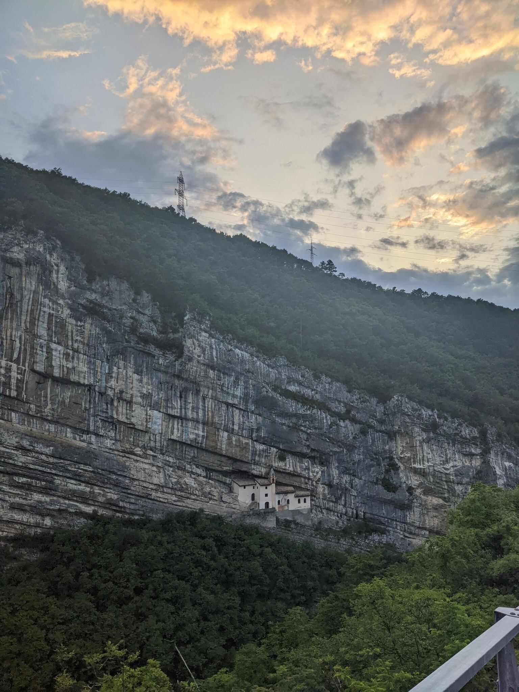
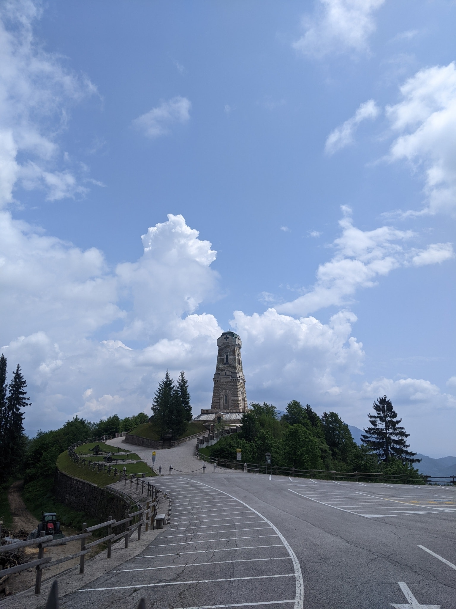
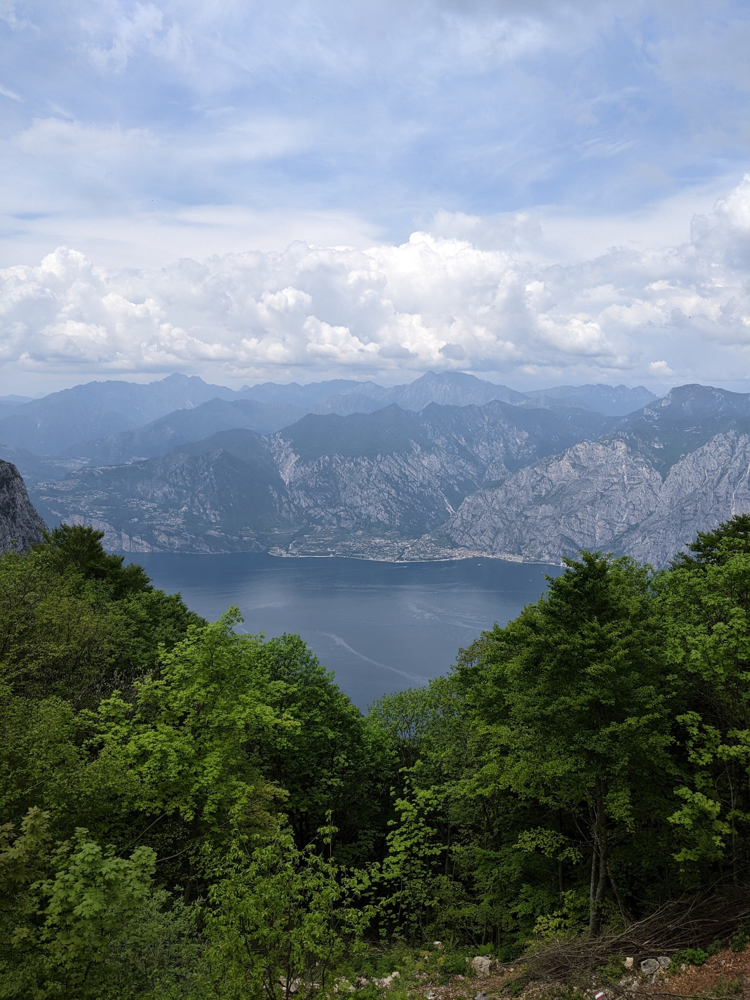
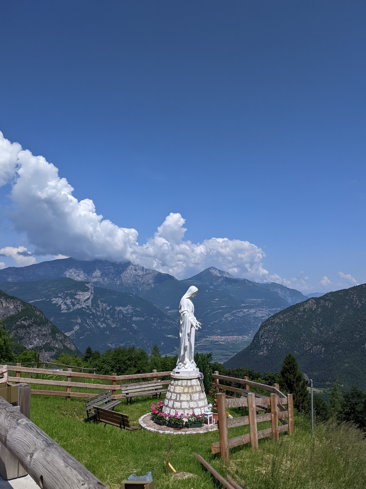

My obsession with cycling continues and this time it has taken me to the province of Trentino. Originally scheduled to coincide with the [16th stage](https://www.giroditalia.it/en/tappe/stage-16-of-the-giro-ditalia-2023-sabbio-chiese-monte-bondone/) of this year's Giro d'Italia, the organizers decided to throw a spanner in the works and bring the race forward by a week. So we were left with road paintings on the key climbs and pink banners all over the place.

- 
- 
{.fluent .escape}

A solo [prologue](https://www.strava.com/activities/9152209086) with almost 1000 m of climbing was a sign of things to come:

- [Strada del Menador](https://www.strava.com/activities/9156961693)
- [Passo Borcola and Pasubio](https://www.strava.com/activities/9163566488)
- [Monte Baldo](https://www.strava.com/activities/9169615417)
- [Passo Bordala](https://www.strava.com/activities/9175048818)
- [Monte Bondone and Monte Velo](https://www.strava.com/activities/9182493042)
- [Passo Coe](https://www.strava.com/activities/9189176957)

These rides added up to almost 18000 m of vertical ascent --- 10% of my all-time in just seven days.

- 
- 
{.fluent .escape}
