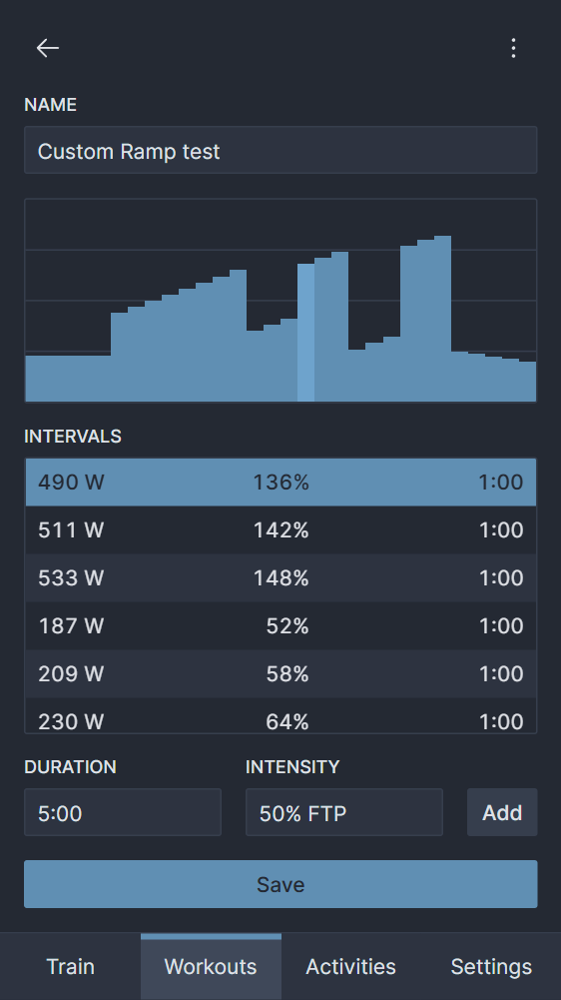
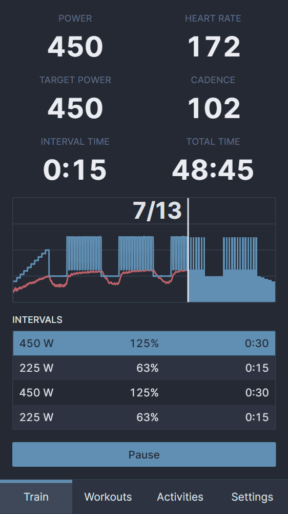
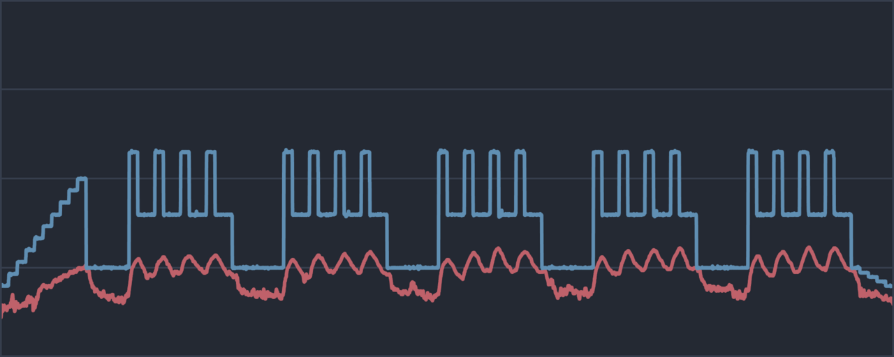

Today, workin celebrates its [second birthday](https://github.com/jsmolka/workin/releases/tag/1.0.0) and the release of [version 2.0](https://github.com/jsmolka/workin/releases/tag/2.0.0). Writing software for oneself and using it extensively feels like a rare thing in software engineering. It begins with `for` loops and calculators in school, advances to sorting algorithms in university and ends with REST applications for work. At no point are you creating something useful for **yourself**.

Stepping into the role of a user offers a different perspective. You notice bugs, missing features and UX flaws. I still remember workouts where time just flew by, but in reality it was running at twice the rate it should have. You also reconsider some design decisions. Reading gets harder with increasing heart rate, so you opt for larger font sizes for relevant UI elements.

Using something for hours daily over weeks also gives you time to think about possible improvements. The feature list grew longer and longer and workin slowly turned into my new [procrastination project](/posts/procrastination-project/). The following chapters explore the most notable features.

## Creator -> Editor
The old version was more like a workout creator than an editor. You were able to add intervals in sequential order and could delete selected ones later. But you better not make any mistakes. There was no interval editing, sorting or insertion in between. Once created, the workout was set in stone. The new editor implements all of those features, has many minor enhancements and also allows you to edit/duplicate existing workouts.

- 
- 
{.fluent}

A recent addition is interval descriptions. [Rønnestad's 13 x 30/15](https://pubmed.ncbi.nlm.nih.gov/24382021/) workouts are hard sessions with short on/off periods. Your heart rate rises, the lactate in your whole body builds up and halfway in you are just suffering. I found myself counting intervals to know when it would end, but most of the time I failed and ended up needing to do one or two more. Interval descriptions solve that problem by counting for me.

## Export
Getting data out of the app is almost as important as the training. At the end of the day, you want to present your precious activity to your followers on Strava. I changed the export format from TCX to FIT, which is the widely supported industry standard. I used [Garmin's FIT JS SDK](https://github.com/garmin/fit-javascript-sdk) because it's much more complicated than the XML-based TCX. There was a minor problem with Strava showing the wrong activity time, but I found a workaround for that.

```js
for (const [i, lap] of laps.entries()) {
  // Duplicate the first record of the first lap. Strava calculates moving
  // time based on the interval between consecutive points, so we need at
  // least two points to produce one second of moving time.
  const records = i === 0 ? [lap[0], ...lap] : lap;
  for (const record of records) {
    const speed = powerToSpeed(record.power);
    encoder.writeMesg({
      mesgNum: Profile.MesgNum.RECORD,
      power: record.power,
      heartRate: record.heartRate,
      cadence: record.cadence,
      speed,
      distance,
      timestamp,
    });
    distance += speed;
    timestamp++;
  }
}
```

But what would an activity be without a pretty picture? Unfortunately, I can't save the SVG used inside the app because of applied CSS and non scaling strokes. I had to recreate the image myself and used the [Canvas API](https://developer.mozilla.org/en-US/docs/Web/API/Canvas_API). Drawing was simple because optimized polylines for power and heart rate are calculated on finish and can be reused for the graphic.



Up until recently, the workflow of uploading an activity to Strava looked like this:

1. Export FIT and graphic.
2. Upload FIT using [Strava's file upload](https://www.strava.com/upload/select).
3. Add a title and graphic to the uploaded activity.

It isn't too complicated but could be optimized by using Strava's API. I have avoided it because the OAuth workflow in a single page application without a server is weird. I can't let everybody use my [API application](https://www.strava.com/settings/api), because I would need to store my client ID and secret as constants in the JS app, which is a big security no no. The workaround is letting the user use his own credentials when generating refresh and access tokens required for uploading.

```js
async upload(activity) {
  const form = new FormData();
  form.append('name', activity.workout.name);
  form.append('file', new Blob([activity.toFit()]));
  form.append('data_type', 'fit');
  form.append('sport_type', 'VirtualRide');
  form.append('trainer', 1);

  const response = await axios.post('https://www.strava.com/api/v3/uploads', form, {
    headers: { Authorization: `Bearer ${await this.accessToken()}` },
  });
  return await this.status(response.data.id_str);
}
```

The Strava API doesn't support image upload, so the user has to add it manually. Other indoor training apps like Zwift and TrainerRoad seem to have access to a custom version with image support, but mere mortals like myself aren't allowed to use it.

## PWA
Using the Strava API also meant that there was no need to open other websites after finishing a workout. The app was now self-contained and ready to be turned into a progressive web app. There are multiple ways to do that, but adding a simple [manifest](https://github.com/jsmolka/workin/blob/master/public/manifest.json) makes it installable. There is no advantage apart from freeing up vertical space by removing the browser's address bar.

I had some trouble with the icon and needed to add additional padding to an already padded icon to fit within the [maskable icon safe zone](https://w3c.github.io/manifest/#icon-masks).

## Fin
So, that's it. Two years of development condensed into a short post. Most of it happened during the cold months when I was actively using workin and noticed its flaws. Of course, there were many minor changes and improvements, but those mentioned here are the important ones. I think the app is now in a good place and doesn't need further improvement, but I have thought that about many things many times in the past.
