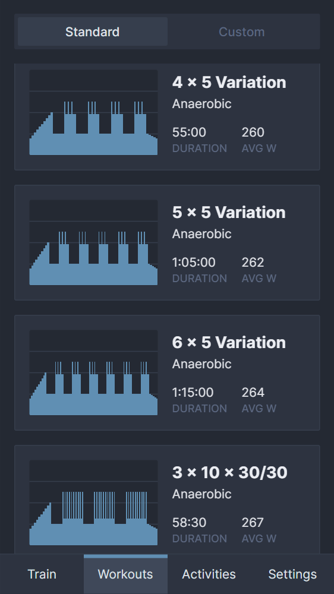
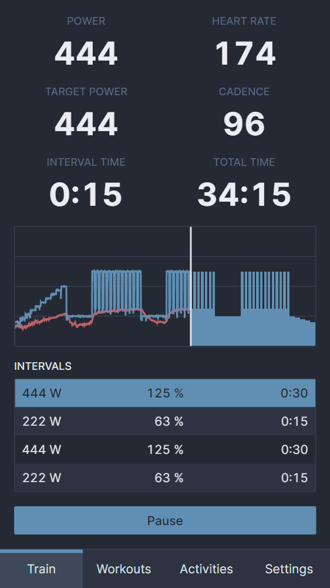

Despite their name, smart trainers are pretty dumb out of the box. To get the most out of them, you need an external service like [Zwift](https://zwift.com/) or [TrainerRoad](https://www.trainerroad.com/) to control the target power. These services are usually subscription-based and cost around 15$ per month. For that price, you can choose between watching a road race video, playing a video game or staring at blue bars [^1].

[^1]: I am team blue bars. Place the phone in the background and watch a good show.

## Workouts
The most important aspect for me is high-quality workouts. Intervals should be simple --- spend a certain amount of time at a certain intensity to elicit a training response. Unfortunately, most third-party apps use complicated workouts with ramps and frequently changing interval intensities to keep the user's attention. Even the science-based TrainerRoad falls victim to this.

Since nothing on the market met my needs at a reasonable price, I decided to write my own app. It had to run on a smartphone because that's the setup I use. I could have tried to develop a native app, which would have had some advantages regarding the Bluetooth API, but I took the path of least resistance and went with a simple web app. Getting used to Vue 3's new composition API was enough new information for one project.

The class structure for intervals, workouts and activities is surprisingly simple:

```js
class Interval {
  constructor(seconds, intensity) {
    this.seconds = seconds;
    this.intensity = intensity;
  }
}

class Workout {
  constructor(name, intervals) {
    this.name = name;
    this.intervals = intervals;
  }
}

class Activity {
  constructor(workout) {
    this.date = new Date();
    this.workout = workout;
    this.data = [];
  }
}
```

I have consumed a fair amount of training-related content this year and decided to focus on workouts used in polarized training. Many of these intervals have been tested in studies by Stephen Seiler and Bent Rønnestad. I ended up with [13 unique workouts and a few variations of each](https://github.com/jsmolka/workin/blob/master/src/stores/data/workouts.js):

```js
workout('4 x 8', [
  warmup,
  repeat(4, [
    interval('8:00', 1.05),
    interval('4:00', 0.5),
  ]),
  cooldown,
]),

workout('3 x 10 x 40/20', [
  warmup,
  repeat(3, [
    repeat(10, [
      interval('0:40', 1.25),
      interval('0:20', 0.5),
    ]),
    interval('5:00', 0.5),
  ]),
  cooldown,
]),
```

The UI to select and view workouts looks like this:

- 
- 
{.fluent}

## Web Bluetooth API
Communication between the app and smart trainer occurs via the [Web Bluetooth API](https://developer.mozilla.org/en-US/docs/Web/API/Web_Bluetooth_API). [Support](https://developer.mozilla.org/en-US/docs/Web/API/Web_Bluetooth_API#browser_compatibility) in browsers other than Chromium is non-existent, and even Chromium doesn't support all features without experimental feature flags. That's a shame because I can't use nice-to-have features like automatic device reconnection on page reload. However, it does support enough of the standard to develop a fully functional app.

The [Web Bluetooth Communication Group's GitHub account](https://github.com/WebBluetoothCG) has several demos describing how to use the API, including one for a [heart rate monitor](https://github.com/WebBluetoothCG/demos/blob/gh-pages/heart-rate-sensor/heartRateSensor.js). That's one of the two devices I need to support. Unfortunately, it's the easier one, and the smart trainer is a bit more complicated. It uses the [Fitness Machine Service protocol](https://www.bluetooth.com/specifications/specs/fitness-machine-service-1-0/) and defines several characteristics to interact with it:

- **Fitness Machine Feature**: this characteristic provides information about the type of device and its features. Device types include treadmills, cross trainers, step and stair climbers, rowers and indoor bikes. We are interested in the latter. Each device supports features, properties that can be read, and target features, properties that can be set. Smart trainers tend to provide power and cadence and support target power setting.
- **Supported Power Range**: this characteristic provides information about the supported power range. It includes minimum wattage, maximum wattage and step resolution.
- **Indoor Bike Data**: this characteristic provides training-related data and periodically sends notifications to the client.

  ```js
  parse(stream) {
    const fields = {
      averageSpeed: { flag: 1 << 1, data: 'u16' },
      cadence: { flag: 1 << 2, data: 'u16' },
      averageCadence: { flag: 1 << 3, data: 'u16' },
      distance: { flag: 1 << 4, data: 'u24' },
      resistance: { flag: 1 << 5, data: 's16' },
      power: { flag: 1 << 6, data: 's16' },
      averagePower: { flag: 1 << 7, data: 's16' },
      expendedEnergy: { flag: 1 << 8, data: ['u16', 'u16', 'u8'] },
      heartRate: { flag: 1 << 9, data: 'u8' },
      metabolicEquivalent: { flag: 1 << 10, data: 'u8' },
      elapsedTime: { flag: 1 << 11, data: 'u16' },
      remainingTime: { flag: 1 << 12, data: 'u16' },
    };

    const flags = stream.u16();
    for (const [name, { flag, data }] of Object.entries(fields)) {
      if ((flags & flag) === 0) {
        continue;
      }

      if (data instanceof Array) {
        this[name] = data.map((type) => stream[type]());
      } else {
        this[name] = stream[data]();
      }
    }
  }
  ```

  Each notification consists of a 16-bit flags field and its associated data. The flags field defines which parameters are present in the data stream. The size and resolution of each parameter are defined in the specification.

  ```js
  const parameters = {
    speed: ['u16'], // 0.01 km/h
    incline: ['s16'], // 0.1 %
    resistance: ['u8'], // 0.1
    power: ['s16'], // 1 W
    heartRate: ['u8'], // 1 bpm
    stop: ['u8'], // Opcode
    expendedEnergy: ['u16'], // 1 calorie
    stepCount: ['u16'], // 1 step
    strideCount: ['u16'], // 1 stride
    distance: ['s24'], // 1 m
    trainingTime: ['u16'], // 1 s
    timeIn2HeartRateZones: ['u16', 'u16'], // 1 s
    timeIn3HeartRateZones: ['u16', 'u16', 'u16'], // 1 s
    timeIn5HeartRateZones: ['u16', 'u16', 'u16', 'u16', 'u16'], // 1 s
    indoorBikeSimulation: ['s16', 's16', 'u8', 'u8'],
    wheelCircumference: ['u16'], // 0.1 mm
    spinDown: ['u8'], // Opcode
    cadence: ['u16'], // 0.5 rpm
  };
  ```
  At one point I wondered why the reported cadence was twice the actual value until I realized that cadence is transmitted in 0.5 rpm increments.
- **Fitness Machine Control Point**: this characteristic handles all communication with the trainer.

    ```js
    const opcodes = {
      requestControl: 0x00,
      reset: 0x01,
      speed: 0x02, // 0.01 km/h
      incline: 0x03, // 0.1 %
      resistance: 0x04, // 0.1
      power: 0x05, // 1 W
      heartRate: 0x06, // 1 bpm
      start: 0x07,
      stop: 0x08, // Opcode
      expendedEnergy: 0x09, // 1 calorie
      stepCount: 0x0a, // 1 step
      strideCount: 0x0b, // 1 stride
      distance: 0x0c, // 1 m
      trainingTime: 0x0d, // 1 s
      timeIn2HeartRateZones: 0x0e, // 1 s
      timeIn3HeartRateZones: 0x0f, // 1 s
      timeIn5HeartRateZones: 0x10, // 1 s
      indoorBikeSimulation: 0x11,
      wheelCircumference: 0x12, // 0.1 mm
      spinDown: 0x13, // Opcode
      cadence: 0x14, // 0.5 rpm
    }
    ```

    The data written to this characteristic is a byte array, that encodes the opcode and its parameters. Upon initial connection, I request control and reset the trainer. Later, during the workout, I set the target power to that of the current interval. The characteristic also sends notifications, that contain information about whether the request was successful or not.

One annoying thing that happened with my heart rate monitor was frequent disconnects. I was working on the app and had it open on my second monitor. The heart rate monitor would randomly disconnect even though I was still wearing it. I added code to reconnect automatically:

```js
this.device.addEventListener('gattserverdisconnected', async () => {
  try {
    await exponentialBackoff(5, 250, async () => await this.connect());
  } catch {
    this.emit('disconnected');
  }
});
```

I hope the disconnects don't happen during workouts. Maybe the low heart rate during programming caused the heart rate monitor to go into some sort of power-saving mode, but that would be odd behavior, to say the least.

## Train
The last thing on the list was the train view. I had to make the numbers big enough to be readable with a racing heart and muscles full of lactate. It contains the six most important metrics, a live graphic of the workout and the upcoming intervals. I don't think I'll be able to read the interval intensities and durations while I'm training, but I had to fill the screen with something and it looked good.

- 
- 
{.fluent}

I also implemented automatic start and pause based on pedaling. Two very useful features when taking a nature break.

## Final Words
The whole thing turned out better than expected. A month of concentrated work, some new technologies and an interesting project to obsess about. So far I have done one test run and everything has worked fine. I hope it stays that way and I don't lose any training data in the future. That would be **really** annoying. The code is available on [GitHub](https://github.com/jsmolka/workin) and the app is hosted on [Vercel](https://workin.smolka.dev/).
