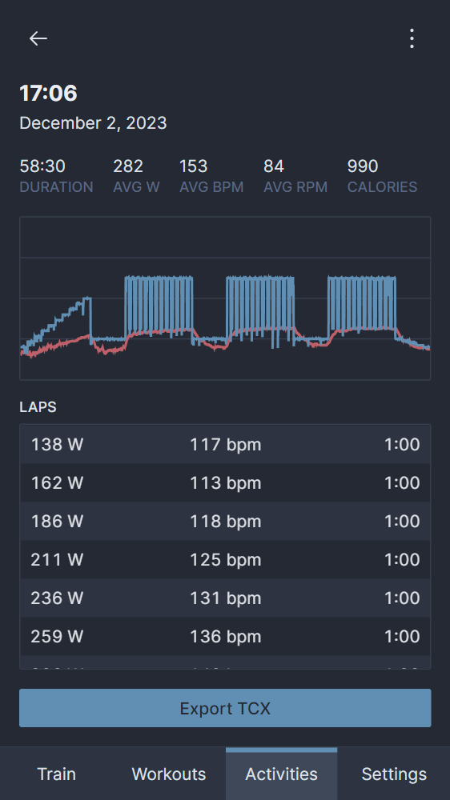

# workin
[workin](https://github.com/jsmolka/workin) is a web app for creating and running smart trainer workouts. It uses the [Web Bluetooth API](https://developer.mozilla.org/en-US/docs/Web/API/Web_Bluetooth_API) to communicate with heart rate monitors and smart trainers that implement the [Fitness Machine Service protocol](https://www.bluetooth.com/specifications/specs/fitness-machine-service-1-0/). It offers the main features of paid alternatives, has a wide range of standard workouts and allows easy creation of custom workouts.

- 
- 
{.fluent}

# sprite
[sprite](https://github.com/jsmolka/sprite) is a Game Boy emulator written in [drizzle](#drizzle) and serves as the ultimate stress test for the programming language. It implements most components of the system with reasonable accuracy, but there is no sound or saves, and the cartridge types are limited to MBC0, MBC1 and MBC3.

- 
- 
{.fluent}

The initial implementation didn't even manage to emulate the console at half speed. Optimizations, like using a [specializing adaptive interpreter](/posts/a-new-hope/#specializing-adaptive-interpreter) in drizzle and replacing the class with free functions and variables in sprite, increased the performance to 125%, which resulted in a stable frame rate at native speed.

# drizzle
[drizzle](https://github.com/jsmolka/drizzle) is a dynamically interpreted programming language with a syntax similar to Python.

```drizzle
class Point:
  def init(x, y):
    this.x = x
    this.y = y
  def cross(other):
    return this.x * other.y - this.y * other.x

# Stokes' theorem
def area(polygon):
  var s = 0
  for i in 0 .. len(polygon):
    s = s + polygon[i - 1].cross(polygon[i])
  return s / 2

var triangle = [Point(0, 0), Point(4, 4), Point(0, 4)]

assert(area(triangle) == 8.0)
```

It started as an exercise for language design and whitespace-aware parsing and grew into something powerful enough to run a [Game Boy emulator](#sprite). It provides simple SDL2 and filesystem abstractions to achieve that. The latest version also features a [specializing adaptive interpreter](/posts/a-new-hope/#specializing-adaptive-interpreter) to squeeze out the last bit of performance.

- 
- 
{.fluent}

# eggvance
[eggvance](https://github.com/jsmolka/eggvance) is a fast and accurate Game Boy Advance emulator. The processor grew instruction by instruction in conjunction with its [test suite](https://github.com/jsmolka/gba-tests) to ensure a solid implementation with all edge cases covered.

- 
- 
{.fluent}

Other components of the system soon followed, and the emulator got to a stage where it was able to run most games and demos you threw at it. Around that time, I spent a weekend porting it to [WebAssembly](https://eggvance.smolka.dev). Audio emulation was something I had been putting off until the end due to my lack of experience, but I managed to do it eventually.



The final year of development went into performance and accuracy improvements. I released version 1.0 around 2.5 years after the initial commit and wrote a couple of [progress reports](/tags/eggvance/) along the way.

# maze
[maze](https://github.com/jsmolka/maze) was my introductory project to programming and the thing I tinkered with during boring lectures. It creates and solves perfect mazes using different algorithms, each with its own recognizable style. I also implemented the recursive backtracking algorithm in C, which sparked my interest in high-performance code.

- 
- 
{.fluent .pixelated}
